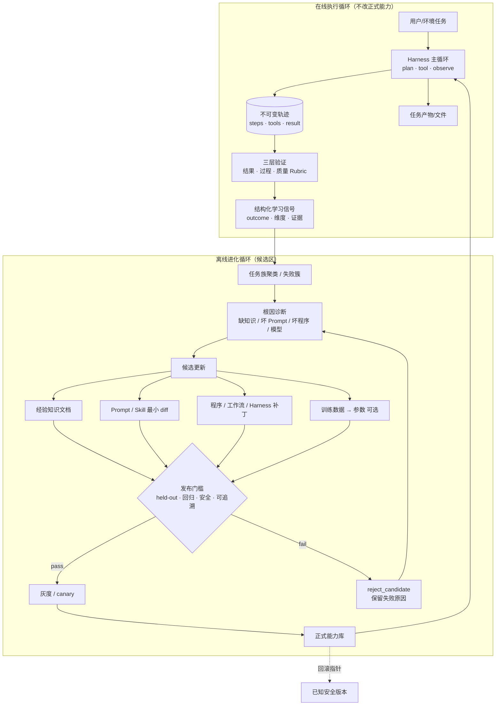

# 自进化 / 自改进 Agent Harness 格局（2025–2026）

Type: research
Status: historical
As-of: 2026-08-06

> 调研范围：生产与研究侧的 self-evolving / self-improving agent harness。  
> 本地对齐：`ai-agent-book` 第 8 章「Agent 的持续进化」。  
> Yishu 落点：`packages/agent-core`。  
> 写法：一手来源优先；不确定处标 **[不确定]**。

---

## 1. 一句话结论

2025–2026 的共识不是「让模型边跑边改权重」，而是：**在模型外围搭可验证的学习系统**——记录轨迹 → 评价学习信号 → 更新知识 / Prompt / Skill / 程序（Harness）→ 回归与发布门槛 → 再服务。近端路径是 **harness 进化**（Lilian Weng 2026；书 ch8），不是 Gödel 机式的权重自改。

---

## 2. 通用架构模式

现代系统几乎都收敛成 **在线执行 + 离线进化** 双循环。在线只做事与记证据；离线才聚合、诊断、生成候选、过门槛后发布。



### 2.1 更新写到哪里（四种载体）

与书 ch8 表 8-2 一致：

| 载体 | 适合承载 | 优势 | 局限 |
|------|----------|------|------|
| 经验知识库 | 事实、例外、行动规律 | 快、可追溯、可检索 | 靠检索与模型正确应用 |
| Prompt / Skill | 可语言化的策略与操作规范 | 可解释、作用域可控 | 膨胀、冲突、被忽略 |
| 程序 / Harness | 确定性流程、重试、熔断、工具 | 可测、稳、便宜 | 工程成本高 |
| 模型参数 | 风格、感知、隐式策略 | 泛化强、推理便宜 | 回归与安全成本高 |

### 2.2 搜索尺度（从浅到深）

Weng（2026）与书 ch8 的正交轴：优化对象可以扩大为

`单条规则/记忆 → 结构化上下文 → 工作流 → Harness 代码 → 优化器代码`

默认选 **最浅、可归因、可回滚** 的一层；只有局部补丁长期无效才上抬。

### 2.3 什么 × 何时（3×3 简图）

Xinming Tu（2026）用 **更新基底 × 持久时界** 分类：

| | 外部文件（记忆/知识/Skill） | Agent Harness（prompt/工具/流程） | 模型权重 |
|--|--|--|--|
| **单任务内** | 草稿、scratchpad | 动态编排、临时分支 | Test-time training **[研究多]** |
| **跨会话** | Skill 库、MEMORY、AGENTS.md | 编译工作流、Meta-Harness | 个性化 LoRA **[产品少]** |
| **跨用户** | 共享 skill commons | 平台 harness 飞轮 | 用验证轨迹做下一轮训练 |

**生产默认落点**：跨会话的外部文件 + 受控 Harness 补丁；权重更新走离线训练流水线，不在热路径。

---

## 3. 框架对照表（8 项）

| 名称 | 主要学习信号 | 更新目标 | 门禁 / 验证 | 开源 / 一手链接 |
|------|--------------|----------|-------------|-----------------|
| **Voyager** (2023, 范式源头) | 环境状态 + 执行错误 + 自验证 | 可执行 skill 代码库 | 环境通过才入库；可迁移到新世界 | [arxiv:2305.16291](https://arxiv.org/abs/2305.16291) · [minedojo/voyager](https://github.com/minedojo/voyager) |
| **ADAS / Meta Agent Search** (ICLR 2025) | 任务基准分 | 用代码定义的整套 agent 设计（prompt+流程+工具组合） | 在 archive 上迭代；跨域迁移实验 | [arxiv:2408.08435](https://arxiv.org/abs/2408.08435) · [ShengranHu/ADAS](https://github.com/ShengranHu/ADAS) |
| **Darwin Gödel Machine (DGM)** (2025) | 编程基准（SWE-bench 等） | **Agent 自身代码库**（含自我修改能力） | 经验验证每处代码变更；开放式 archive | [arxiv:2505.22954](https://arxiv.org/abs/2505.22954) · [jennyzzt/dgm](https://github.com/jennyzzt/dgm) · [Sakana](https://sakana.ai/dgm/) |
| **GEPA** (2025, ICLR 2026) | 标量 metric + **自然语言轨迹反馈** | 文本组件（prompt 为主，可扩到配置） | Pareto / 遗传式搜索；rollout 预算 | [arxiv:2507.19457](https://arxiv.org/abs/2507.19457) · [dspy.GEPA](https://dspy.ai/api/optimizers/GEPA/overview/) · [gepa-ai/gepa](https://github.com/gepa-ai/gepa) |
| **EvoSkill** (2026) | 执行失败 + 文本反馈 | 结构化 Skill 文件夹（可复用 workflow/code） | held-out 验证；Pareto 的 agent program；**模型冻结** | [arxiv:2603.02766](https://arxiv.org/abs/2603.02766) · [sentient-agi/EvoSkill](https://github.com/sentient-agi/EvoSkill) |
| **ACE / MCE** (2025–2026) | 轨迹成败洞察 | ACE：条目化上下文 playbook；MCE：上下文管理 **skill/机制** | ACE 确定性 merge 防 collapse；MCE 内外双循环 + val | ACE [arxiv:2510.04618](https://arxiv.org/abs/2510.04618)；MCE [arxiv:2601.21557](https://arxiv.org/abs/2601.21557) |
| **OpenHands Skills / AgentSkills** | 人工 + 渐进披露触发 | 按需加载的 `SKILL.md` 包 | 产品侧启用/禁用与权限（非全自动进化） | [OpenHands Skills 文档](https://docs.openhands.dev/sdk/guides/skill) · [agentskills.io](https://agentskills.io/specification) |
| **Aider 架构演进**（产品 harness，非完整自进化） | 用户编辑反馈 + lint/test | Repo map / 上下文选择 / 编辑模式（人驱动改进 harness） | git 提交粒度；测试在用户侧 | [Repo map](https://aider.chat/docs/repomap.html) · 架构笔记见社区 2026 深潜文 |

补充（研究/综述，不单列产品）：

- **Self-Improving Coding Agent** [arxiv:2504.15228](https://arxiv.org/abs/2504.15228)：基础编码工具下自主改自身代码，靠 LLM 反思 + 代码更新，无梯度。
- **SAGE / Skill-Augmented GRPO** [arxiv:2512.17102](https://arxiv.org/abs/2512.17102)：RL + skill library，顺序 rollout 与 skill 相关奖励。
- **Meta-Harness / Self-Harness / Agentic Harness Engineering**：把 harness 源码 + 轨迹分数当作搜索对象（见 Weng 综述与 arXiv 2026 系列；编号以论文页为准）。
- **Claude Code / Hermes**：记忆与 Skill 生命周期（MEMORY 索引、Curator 修剪、审批门）是 **产品级** 自改进配置层，不是 DGM 级代码自改。

---

## 4. 生产级自进化 Harness 的不可妥协规则

下列规则来自书 ch8、Weng、Tu 与各系统共性；违反任一条都不应声称「可上线自进化」。

1. **保存 ≠ 学习**  
   原始轨迹只是证据。必须经过评价、对照、归纳、验证，才算学习信号。

2. **在线执行与离线进化隔离**  
   热路径不直接改正式 Prompt/Skill/程序；只写不可变日志与候选区。

3. **三层验证，维度化信号**  
   结果（环境真值）→ 过程（权限/策略）→ 质量（Rubric）。禁止只靠「用户满意」或单一总分驱动写入。

4. **先定位根因，再选载体**  
   幻觉可能是缺知识、缺引用指令或缺一致性检查；优先最小可验证修改。

5. **候选 vs 正式能力隔离**  
   新 Skill/工具/补丁先进候选；沙盒、回归、安全扫描通过后才服务真实流量。

6. **发布门槛四件套（最低）**  
   - 补丁/文档非空且 **来源轨迹可追溯**  
   - 边界集改善  
   - **保留集不退化**  
   - 安全/注入扫描通过  
   通过也只到 `release_to_canary`，不是静默覆盖 stable。

7. **安全机制不可被业务 Agent 自我修改**  
   验证器、测试用例、发布门槛、审计日志、稳定备份 = 可信根。生成补丁的 Agent 不得改门槛自身。

8. **证据与指令隔离（防注入固化）**  
   网页/工具原始输出是不可信证据；写入 Skill/记忆前必须摘要 + 版本化审阅，禁止原文当规则。

9. **区分 harness-updating 与 harness-benefit**  
   「更新器写出了好 Skill」≠「任务 Agent 会加载并遵循」。评估要拆：候选有效率、产物激活率、遵循成功率、held-out 增益。

10. **支持修剪与回滚**  
    无限追加会上下文腐化。需要合并、归档、失效标记、从 stable 一键回滚。

11. **开放式任务不假装有满分**  
    科研/战略等弱反馈任务：保留阴性结果、搜索多样性、人定义评价标准；勿把「流程跑完」当进步。

12. **默认不改权重**  
    生产自进化优先知识/Skill/程序；参数更新走离线 SFT/RL 流水线与遗忘/安全回归。

---

## 5. Yishu `packages/agent-core` 移植清单

### 5.1 现状（已有）

| 能力 | 路径 | 成熟度 |
|------|------|--------|
| 轨迹记录 | `src/trajectory/recorder.ts`，`data/trajectories/*.json` | 可用 |
| 规则验证 | `src/trajectory/verifier.ts`（空步、final、虚假成功等） | 雏形；非完整三层 Rubric |
| 学习信号 | `src/evolution/learning-signal.ts`（outcome / tools / lessons） | 雏形；维度少、无跨轨迹支持表 |
| Skill 草稿 | `src/evolution/skill-draft.ts`（轨迹 → `SKILL.md`） | 有 `accepted` 门；缺 held-out 与冲突检测 |
| Skill 加载 | `src/context/skills.js` + `skills/*/SKILL.md` | 渐进匹配已有 |
| 记忆 | `src/memory/store.ts` | 用户/项目事实向，非行动经验文档 |
| 评估 | `src/eval/harness.ts` | 任务评估；非进化专用四阶段 |
| 注入扫描 | `src/security/injection-guard.ts` | 部分 |
| 主循环 | ReAct + reviewer、`YishuAgent` | 在线执行完整度高于进化闭环 |

**缺口一句话**：有「单次轨迹 → 信号/草稿」的左半边，缺「聚类 → 候选 manifest → 回归门槛 → canary → 回滚/修剪」的右半边与安全可信根硬边界。

### 5.2 移植优先级（按性价比）

#### P0 - 学习闭环最小可用（对齐 ch8 实验骨架）

| # | 项 | 建议落点 | 完成标准 |
|---|----|----------|----------|
| 1 | **不可变轨迹契约** | 扩展 `Trajectory`：`environment_score`、工具最终状态摘要、`task_family` | 每条 run 可审计；禁止原地改写已写盘轨迹 |
| 2 | **维度化 LearningSignal** | `evolution/learning-signal.ts` | 至少：任务结果 / 规则遵从 / 承诺-行动一致 / 证据充分性；每维 pass\|fail\|uncertain + 证据 step id |
| 3 | **候选区目录** | `data/candidates/{knowledge,skills,prompts,harness}/` | 与 `skills/` 正式库分离；draft 默认只进 candidates |
| 4 | **发布 manifest** | `evolution/release-manifest.ts` | 记录：来源轨迹、根因、目标组件、diff、预期修复、潜在回退、检查结果、回滚版本 |
| 5 | **门槛函数** | `evolution/gate.ts` | `reject_candidate` \| `release_to_canary`；写入不碰 stable |
| 6 | **Harness 接线** | `harness.ts` / `AsyncAgent` | run 结束：verify → extract signal → 可选 draft skill；**默认不 auto-promote** |

#### P1 - 跨轨迹经验与 Skill 生命周期

| # | 项 | 建议落点 | 完成标准 |
|---|----|----------|----------|
| 7 | **任务族聚类 + 支持表** | `evolution/cluster.ts` | 正式知识需 ≥2 条非失败轨迹支持；反例写入 applies_when |
| 8 | **经验知识文档** | Markdown：适用场景 / 推荐策略 / 禁止 / 例外 / 来源 / 最近验证 | 检索只打文档，不塞原始长轨迹 |
| 9 | **Skill 升级路径** | 扩展 `skill-draft` | 同能力优先 patch 已有 SKILL；禁止堆叠近义 generated-* |
| 10 | **激活与遵循指标** | eval + trajectory | 统计：匹配加载率、加载后步骤是否遵循 skill 步骤 |
| 11 | **睡眠/批处理 Curator** | CLI 子命令或 `evolution/curator.ts` | 合并重复、标过期、快照后修剪；可回滚 |

#### P2 - Prompt / 程序层与安全可信根

| # | 项 | 建议落点 | 完成标准 |
|---|----|----------|----------|
| 12 | **系统提示最小 diff** | `evolution/prompt-patch.ts` | old→new 可审计；边界集 + 保留集双测 |
| 13 | **Harness 组件白名单** | 配置：可改 / 不可改路径 | 验证器、gate、审计日志、stable 备份只读于进化 Agent |
| 14 | **注入 → 经验阻断** | 扩展 `injection-guard` | 高风险源不得直接写入 Skill body；必须摘要 + 二次审 |
| 15 | **自修改协议（可选）** | 对齐 ch8 self-modifying-agent | 候选目录 diff；重放失败簇 + 旧任务回归；无权限写 stable |
| 16 | **进化评估套件** | 扩展 `eval/` | 四阶段：学习 / 迁移 / 规则变更 / 保持；对照 static / append_only / evolving |

#### P3 - 非默认（研究或实验室开关）

| # | 项 | 说明 |
|---|----|------|
| 17 | GEPA/DSPy 式批量 prompt 搜索 | 离线优化初始 system prompt；上线后仍用最小 diff 维护 |
| 18 | DGM/ADAS 式 harness 代码进化 | 仅在隔离 sandbox + 固定 eval 预算；**不**进 Clicky 正式壳 |
| 19 | 参数/RL 飞轮 | 过滤后轨迹导出训练格式；训练与 `@yishu/agent-core` 运行时解耦 |
| 20 | Meta-Harness | 优化「如何检索/压缩上下文」的代码；需先有 P0–P1 指标 |

### 5.3 与产品边界对齐（Yishu / Agents.md）

- 进化改的是 **agent-core 能力库与配置**，不是用户可见「第二身份」。
- Pi / `@yishu/runtime` 仍是 execution harness；**学习信号与正式能力版本**归产品侧 agent-core。
- 工具成功 ≠ 任务完成：进化必须以 `verifyTrajectory` + 环境可观察结果为准（已有方向，需加严）。
- 不记录原始凭据、截图隐私、私密对话进经验库。
- 不把失败实验 Kairos/SSE/`forceKairosRouting` 迁回；任务态继续用 typed runtime events。

### 5.4 建议的目录演进（示意）

```text
packages/agent-core/
  src/evolution/
    learning-signal.ts      # 已有 → 维度化
    skill-draft.ts          # 已有 → 候选区 + 冲突
    gate.ts                 # 新增
    release-manifest.ts     # 新增
    cluster.ts              # 新增
    curator.ts              # 新增
    prompt-patch.ts         # 可选
  data/
    trajectories/           # 不可变
    candidates/             # 未过门槛
    experience/             # 正式知识文档
    releases/               # manifest + 回滚指针
  skills/                   # 仅正式 / canary 通过
```

### 5.5 验收口令（移植完成时）

当以下全部为真，可称 agent-core 具备 **生产可用的自进化骨架**（仍非 DGM）：

1. 失败轨迹不能在无 held-out 改善时自动覆盖 `skills/` 或 system prompt。  
2. 任意正式 Skill/知识可追溯到来源轨迹 ID。  
3. 人为注入的网页文本不能静默变成 Skill 规则。  
4. 关掉进化模块后，在线执行仍完整可用（进化是附加环，不是主环硬依赖）。  
5. `pnpm test` 覆盖：gate 拒绝退化候选、canary 路径、回滚、注入阻断。

---

## 6. 关键一手来源

| 主题 | 来源 |
|------|------|
| 书本闭环与四种更新 | `/Users/mahaoxuan/Desktop/AI产品经理/ai-agent-book/book/chapter8.md` |
| Harness 与 RSI | Lilian Weng, *Harness Engineering for Self-Improvement*, 2026-07. https://lilianweng.github.io/posts/2026-07-04-harness/ |
| What×When 矩阵 | Xinming Tu, *The What & When of Self-Evolving Agents*, 2026-06. https://xinmingtu.github.io/blog/2026/self-evolving-agents/ |
| ADAS | Hu et al., arXiv:2408.08435 · https://github.com/ShengranHu/ADAS |
| DGM | Zhang et al., arXiv:2505.22954 · https://sakana.ai/dgm/ · https://github.com/jennyzzt/dgm |
| GEPA | Agrawal et al., arXiv:2507.19457 · https://dspy.ai/api/optimizers/GEPA/overview/ |
| EvoSkill | arXiv:2603.02766 · https://github.com/sentient-agi/EvoSkill |
| Voyager | Wang et al., arXiv:2305.16291 |
| ACE | Zhang et al., arXiv:2510.04618 |
| Karpathy 系统提示学习 | X, 2025-05（见 ch8 脚注） |
| OpenHands Skills | https://docs.openhands.dev/sdk/guides/skill |
| Aider repo map | https://aider.chat/docs/repomap.html |

---

## 7. 风险与未知

- **[不确定]** Meta-Harness / Self-Harness / AHE 等 2026 arXiv 编号与复现成熟度以论文页为准，生产引用前需再核对实验协议。  
- **[不确定]** 各论文在 SWE-bench 等上的绝对分数对 Yishu 个人 Agent 迁移性有限；应自建 held-out 任务族。  
- DGM/ADAS 级自我改代码在权限与供应链风险上极高，**不适合**作为奕枢默认产品路径。  
- 弱反馈领域（产品判断、研究品味）的自动化评价仍是开放问题；人应管标准而非逐步点批准。

---

*文档生成：调研子任务 · 路径 `docs/agent-book/research/self-evolution-landscape.md`*
