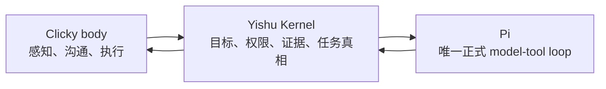

# 奕枢九阶段任务循环

Type: architecture
Status: current
Verified: 209de51 2026-08-13
Review: Pi SDK 版本、九阶段产品规则、Runtime 工厂、Kernel 真相边界或 AgentCore 定位变化时

## 结论

奕枢只有一套正式 Agent 核心循环：**Pi 的 model → tool → result → model 循环**。
`packages/kernel` 在循环外拥有目标、权限、证据、任务完成、记忆和能力采用真相；
`apps/clicky` 提供现场感知、用户沟通和 macOS 执行身体；`packages/runtime` 只把二者接到 Pi。

`MockAgentRuntime` 是协议测试替身，不是 Agent 循环。`packages/agent-core` 是独立实验室，
不再作为 `AgentRuntime` 模式，也不再被 `packages/runtime` 依赖。



## 支持等级

- **Pi 原生**：Pi SDK 已直接提供该循环能力，产品应复用，不重建。
- **Pi 扩展**：Pi 提供 custom tools、Skills、extensions、context、session events 等接缝，奕枢补产品语义。
- **产品拥有**：能力不应由执行 harness 决定，即使 Pi 可以存储或呈现相似数据，也以 Kernel/Clicky 为唯一真相。

## 九阶段能力判断

“奕枢正式落点”描述唯一责任归属，不等于该控制面已经全部完成。当前缺口在表后单列。

| 阶段 | 已确认的产品规则 | Pi 判断 | 奕枢正式落点 |
|---|---|---|---|
| 1. 用户提出目标 | 清楚且低风险直接开始；歧义只问真正阻塞的问题；长任务、高风险或不可逆动作先确认目标、边界和验收结果 | **Pi 原生 + 产品拥有**。`prompt`、`steer` 和 `followUp` 能接收或修正自然语言目标；是否必须提问、是否可行动是产品权限与风险政策 | Clicky 收口输入；Kernel 用不可变 `TaskExecutionContract` 固定 objective、success mode、authority、risk 和一次产品 attempt；Pi 负责理解与下一步决策 |
| 2. 获取当前现场 | 默认使用完成任务所需的最小新鲜现场；扩大到其他窗口、历史、私密或敏感内容时受范围和权限控制 | **Pi 扩展**。Pi 接受文本、图片、custom message 和 context hook，但不提供奕枢的桌面传感器、证据来源、置信度和过期语义 | Clicky 采集 `ContextFrame`；Kernel `ContextTrail` 保存脱敏证据；Runtime 把有界现场注入 Pi |
| 3. 判断下一步 | 不逐步播报隐藏推理；直接做低风险可逆步骤，只在关键检查点、阻塞、风险变化或需要决定时更新用户 | **Pi 原生**。Pi 自带 model-tool 循环、turn events、steering/follow-up 队列和上下文压缩 | Pi 选择执行步骤；Kernel/Clicky 只投影短、可见、可追踪的任务状态，不暴露链式思考 |
| 4. 选择并调用工具 | 用户不需要挑选工具、Skill、MCP 或后台 Agent；能力扩大、敏感访问和高风险动作必须经过产品授权 | **Pi 原生 + Pi 扩展**。内置工具选择、custom tools、Skills、extensions 和运行时 active-tool 切换均已存在 | Runtime 用 capability profile 和 session tool policy 装配 Pi；Kernel Action/authority 决定产品权限；Swift 执行 macOS 动作 |
| 5. 获取行动结果 | 工具返回成功不能直接视为现实结果成功；必须取得新观察、结构化回执或外部可见证据 | **Pi 原生但不足**。Pi 有 `tool_execution_*` 和 tool result，可继续推理；它不知道桌面或外部世界是否真的改变 | 只读交付需非空结果；外部改变只接受进程内标记的 actuator receipt 或 fresh read-back；普通 wire `verified` 不能提升完成度 |
| 6. 根据结果继续或调整 | 低风险、可逆且仍在原授权内时自主换方法；重复失败、权限扩大、成本或风险显著变化时停止并询问 | **Pi 原生 + 产品拥有**。Pi 会把 tool error 回注循环，支持 steer、follow-up、abort，并可对瞬时模型错误自动 retry；任务尝试预算和风险升级不是 Pi 的产品决定 | 每个 request 在发送 Pi 前消耗唯一的产品 attempt；authority 改变、risk 提高或预算用尽都升级而不再发送；Pi 内部 transport/model retry 不算新产品 attempt |
| 7. 判断整个任务是否完成 | 回到最初目标和成功条件，验证最终可观察结果；某一步成功不等于任务完成 | **产品拥有**。Pi 能在无更多 tool call 时结束 Agent run，但这只代表模型停止，不代表用户结果已达成 | Kernel 按 `TaskExecutionContract` 投影 `completed` / `verified` / `blocked` / `failed`；重复 request 只回放产品记录，真人“从头重试”必须创建新 request |
| 8. 把结果告诉用户 | 优先说明发生了什么、证据是什么、还有什么未确认或需要用户决定；语音不朗读协议、URL 噪声或隐藏推理 | **Pi 原生 + 产品拥有**。Pi 提供流式文本和 lifecycle events；内容清洗、TTS、Presence 与最终责任表达属于产品 | Runtime 投影 typed events；Clicky 浮层、Presence 和 TTS 呈现；Kernel 保存最终可见输出和有界回执 |
| 9. 保存、记住并继续 | 后台自动整理、合并和更新长期记忆；自动产生候选能力并经测试、对比、回归后采用或回滚；用户可查看、修改、删除、关闭或撤销；敏感信息、权限扩大、高风险习惯和重大行为变化先询问 | **Pi 扩展但产品拥有**。Pi 有 session JSONL、compaction、Skills 加载和资源 reload；这些不是产品长期记忆、能力治理或用户控制面 | Kernel evidence store 拥有记忆、Learning、Skill、Mandate 和 provenance；能力采用必须走产品 gate；Clicky 应提供“记住了什么”“最近学会了什么”入口 |

## 当前产品缺口

- `TaskExecutionContract` 目前只有“只读交付”和“外部改变”两种成功模式，且每个 request 固定一次产品 attempt；它不是通用 workflow/checkpoint 引擎。
- 任务中断后不保存可续跑 checkpoint；Clicky 只能由真人发起新 request 从头重试，或开始新方向。
- 分布式 / 多进程 exactly-once 仍未实现；Desktop lease 只保护当前 Runtime 进程。
- 阶段 9 已有记忆 list/forget、bounded recall、Learning/Skill 数据结构和实验室 evolution gate；
  明确 Learning 已能在同 scope 的后续普通 turn 中被使用；记忆编辑/总开关、“最近学会了什么”、能力禁用/撤销和自动候选采用流水线尚未完成。
- Pi 的 session persistence 是可用 SDK 能力，但正式产品仍故意使用 in-memory Pi session；Kernel 是唯一恢复真相。
  冷启动时 Runtime 会从同 scope / conversation 的 durable completed turns 有界回填可见对话，热 session 不重复注入；子 session 终态后仍立即释放，不把 Pi JSONL 当产品状态。
- 后台委派已能在用户空闲时主动回访并保留后续指代。明确说“我下次切回这个应用时，提醒我…”也已形成持久的一次性 initiative：离开后 armed、返回后原子完成并主动播报一次；它仍不是通用时间/外部状态 scheduler。
- 普通纯对话已按安全句界串行 TTS，首个完整句可在模型终态前开口，终态只补未播尾句；桌面动作意图仍 final-only。二次 PTT 按下会立即停掉旧语音并撤下旧显示。若旧轮仍是纯对话且尚无桌面效果，新话在同一会话中接成下一段；只要涉及屏幕、动作或无法确定，便取消旧轮，重新采集现场并开始新轮。Runtime 的代际/动作门与 Clicky 的语音轮次/展示/执行所有权共同隔离旧回答与旧动作。
- 这不是底层模型逐字即时中断：切换发生在安全的回答边界，用户听到和看到的切换则是立即的。真人 Control + Option PTT 整链仍待人工验收。

## AgentCore 处置

| 处置 | 能力 | 规则 |
|---|---|---|
| **保留为实验室** | 黄金任务、Judge、统计显著性、轨迹校验、skill draft、benchmark、promote/rollback gate、多 Agent 对照实验 | 继续由 `packages/agent-core` 的 CLI 和测试独立运行，不接正式用户数据，不拥有产品真相 |
| **迁移到产品端口** | 注入防护、评估指标、候选 Skill 生成、回归门禁等与特定 ReAct 循环无关的成熟算法 | 逐项迁入 Kernel 或 Runtime 的产品模块并添加正式闭环测试；本次已将 Runtime 使用的 untrusted-content 防护迁出 AgentCore |
| **退出正式路径** | `AgentCoreRuntime`、`YISHU_RUNTIME_MODE=agent-core`、Runtime 对 `@yishu/agent-core` 的依赖、第二套生产 ReAct/工具/记忆/session 真相 | 边界守卫拒绝重新接入；旧环境值按未知值回落到 `pi`，不会启动第二循环 |

## 直接证据

- Pi `AgentSession`：`prompt`、`steer`、`followUp`、`abort`、tool events、queue events、compaction、session persistence。
- Pi SDK：`createAgentSession` 的 tool allowlist、custom tools、`ResourceLoader`、Skills 和 extension factories。
- 产品接线：`packages/runtime/src/pi-runtime-adapter.ts`、`product-kernel-runtime.ts`、`capability-profiles.ts`。
- 唯一循环门禁：`packages/runtime/src/runtime-factory.ts` 与 `script/check-product-boundaries.sh`。
- 产品真相：`packages/kernel` 的 Conversation、Memory、ActionReceipt、Skill 和 TaskTruth。

## 验收

```bash
pnpm product:check
```

必须同时满足：边界守卫通过、Runtime 不依赖 AgentCore、旧 `agent-core` 环境值不能选择第二循环、
Pi 与 mock 协议测试通过、Kernel/Runtime/Swift 核心测试通过。用户可见改动仍需运行正式 Clicky 验收。
