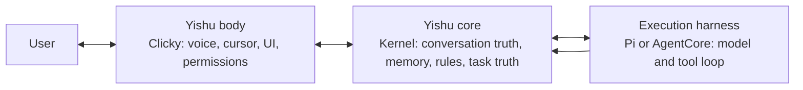

# Architecture

```text
                    Yishu single macOS application
       apps/clicky - formal Clicky source and install source
 cursor | panel | PTT | StepFun ASR | streamed response | MiniMax TTS
                              |
                  Clicky CompanionManager
       identity | relationship | cancellation | presentation
                 /                              \
 local named-click resolver                 complex turns
 Vision OCR -> AXPress / guarded Quartz         |
          |                 YishuContextFrameCollector
          |                        |
          |                 ContextFrame (NOW)
          |                        |
          |              packages/kernel product layer
          |         ContextTrail (recent past, no image bytes)
          |         YishuActionRegistry + YishuStore
          |         remember | remember_how | share_context | ...
          |                        |
          |              /         |          \
          |          local      PiRuntime   Cua / cells
          |       (store/AX)   Adapter      (handoff capsule)
          |                        |
          |              verify -> ActionReceipt / presence
          \________________ verified presentation _______________/
```

Product path in one line:

`Clicky → ContextFrame → ContextTrail → YishuAction → (local | Pi | Cua) → verify → presence`

## Source and runtime ownership

`apps/clicky` is the only formal Clicky source and installation surface. It owns
shipping presence, voice, permissions, TTS, settings, bundle identity, and the
user-visible shell. `apps/macos` is a development and integration harness only:
it uses `com.yishu.yishu-lab`, must not become a second login item, and is not a
second product.

`packages/kernel` (`@yishu/kernel`) is the product action, trail, and evidence
store layer. It does not replace Pi. Voice, UI, initiative, MCP, CLI, Pi, and
system callers should share the same `defineYishuAction` registry and
`ActionReceipt` shape.

Pi remains the execution harness. Swift remains the macOS actuator through
Accessibility and Quartz. Product identity, relationship memory, initiative,
permissions, and task truth stay in Yishu-owned ports and protocols.

## One product, three internal responsibilities

The names describe replaceable responsibilities, not separate products. The
user sees only Yishu:



The unification rule is therefore **one identity, one durable product truth,
multiple replaceable executors**. Clicky owns a stable `conversationId` across
app restarts. Each request ID is the turn ID, and its trace ID remains stable
for start, steering, and cancellation. `ProductKernelRuntime` projects visible
turns and safe typed execution events into Kernel's `Conversation` / `Turn` /
`Event` ledger before it reports terminal success.

Every new Clicky conversation also carries one explicit `SessionScope`:
`personal`, `project(projectId, projectLabel)`, or `private`. Switching scope
rotates `conversationId` and clears Clicky's fallback cache. A project ID is
stable when the user leaves and returns to the same project; it is never
inferred from a window, folder, or model response. Legacy v1 commands without a
scope are treated as personal. Private conversations are live-only: they do not
read or write memory and do not create durable conversation, turn, trail, or
TaskTruth rows; private is never restored after an app restart.

Pi sessions and Clicky's short fallback history may cache data for latency or
continuity, but neither is authoritative. Reusing a completed turn replays the
Kernel record instead of executing tools again; an interrupted open turn fails
closed for recovery. Task execution state remains a separate `TaskTruth`
projection linked by the same turn ID, so a conversation is not mistaken for a
task.

The shipping concurrency boundary is one Clicky-managed sidecar using SQLite.
The ledger is not yet a distributed execution lease: multiple runtime processes
must not share one request ID, and the JSON backend is a single-process
development fallback rather than a multi-process store. A future process lease
is required before multi-runtime execution can claim exactly-once semantics.

The durable ledger stores user-visible input, final assistant output, and a
small allowlist of typed receipts/status metadata. Streaming deltas, tool
arguments, screenshots, audio, hidden reasoning, credentials, and arbitrary
provider payloads are not persisted. This foundation does not yet provide a
history/recovery UI or automatic long-term memory retrieval.

Agent Native is a design-methodology source only, not a Swift or Node
dependency. We borrow the shape of one typed Action, a fresh
target/observation reference, execution-time revalidation, a structured receipt,
and visible read-back. No Agent Native package or runtime is imported or
executed here.

Kairos is historical context from the separate Kairos project only. Its bridge,
SSE progress stream, `RunProgressPresenter`, and `forceKairosRouting` are not a
dependency, fallback, or runtime path in Yishu.

## Runtime boundary

The canonical Clicky app and runtime communicate through versioned newline-delimited JSON during the first integration slice. Every command and event has a request ID, trace ID, schema version, and timestamp.

Computer actions use the same boundary: Pi emits a typed `computer.action.requested`; the macOS shell executes it through Accessibility and answers with `computer.action.result`. Provider tool syntax is never a presentation format. Direct-action turns are buffered until that result arrives, and completion is verified from Accessibility state, frontmost-window state, or changed screen content. The receipt carries the action identity, execution method/attempt, success state, verification state, message, and bounded evidence so a tool return is never mistaken for visible completion.

An explicit click on a visually named control first goes through a deterministic local action router. It limits OCR to the requested screen region, resolves the visible label, and uses the same verified actuator contract without paying for a model turn. The actuator prefers `AXPress`; when a self-drawn app exposes only inert accessibility groups, it confirms that the captured frontmost app still owns the point, hides the cursor, posts one Quartz click, and immediately restores the cursor before verifying screen change. If local evidence cannot resolve the target, the request falls through to the normal ContextFrame and Pi path. Legacy `[POINT]` output is presentation-only unless the original user turn is itself a direct click request; in that case Clicky upgrades it to the same verified action path and never speaks tool syntax or asks the user to finish the click.

`AgentRuntime` is a ports-and-adapters boundary. Product state must not store Pi event objects or Pi session types. Cancellation, steering, errors, completion, and future checkpoints are product-level concepts with conformance tests.

### Task truth boundary

`ProductKernelRuntime` observes typed runtime events but does not let Pi own
task state. The first `tool.started` or `computer.action.requested` creates a
Kernel progress signal; Kernel's `TaskTruthProjector` applies lifecycle,
privacy, evidence bounds, and persistence policy. `response.completed` reaches
`done` only with `verified: true`; otherwise the task stays `blocked`. Pure
conversation and local product actions do not manufacture `TaskTruth`—the
latter already return a product-owned `ActionReceipt`.

Pi and AgentCore therefore remain replaceable event producers. Cancellation
closes the request before delayed events can create or reopen a task, and
runtime disposal waits for active event producers before the final store
flush. The Clicky task UI and cross-request retry/parent linkage remain later
product surfaces; persistence is not itself a visible task manager.

## Capability profiles

- `conversation`: no generic shell/file tools; used by the persistent voice relationship session.
- `observe`: Pi read-only tools.
- `build`: Pi read, search, shell, edit, and write tools inside a task cell.
- `owner`: broad tools in an explicitly selected environment.

The presence of a restricted conversation profile does not remove tools from Yishu. It keeps dialogue and task execution in different sessions with different working surfaces.

## Single-app rule

`apps/clicky` carries the shipping interaction identity `com.yishu.yishu-buddy` and is the only formal source and install path for Clicky. The standalone `Yishu.app` in this repository remains a test harness with `com.yishu.yishu-lab`; it must not be installed as another login item or left listening beside the canonical app. The shipping Clicky build owns ContextFrame collection and starts the bundled Pi runtime behind its existing `CompanionManager`.

The current Grok selector and local 8317 route are preserved as model policy. Clicky sends only an allowlisted `{ provider, model }` preference; `PiRuntimeAdapter` maps it into a product-owned custom provider fixed to `http://127.0.0.1:8787/v1`. Neither arbitrary base URLs nor headers cross the runtime protocol. The old local `/chat` route remains a controlled continuity fallback while a physical push-to-talk turn is still a manual acceptance gate.

## Context frame

A frame contains:

- cursor position and recent pointer samples;
- frontmost application and window;
- accessibility element under the cursor when permitted;
- cursor-display screenshot when permitted;
- warnings for unavailable sensors;
- capture time and per-source confidence.

Screenshot bytes travel as image input and are never copied into text prompts or logs.
