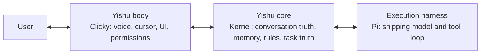

# Architecture

Type: architecture
Status: current
Verified: 4b1e3b1 2026-08-12
Review: apps/ 或 packages/ 结构、ownership、数据流变化时

```text
                    Yishu single macOS application
       apps/clicky - formal Clicky source and install source
 cursor | panel | PTT | StepFun ASR | streamed response | MiniMax TTS
                              |
                  Clicky CompanionManager
       identity | relationship | cancellation | presentation
                 /                              \
 local named-click resolver                 complex turns
 Vision OCR -> AXPress / guarded Quartz         |
          |                 YishuContextFrameCollector
          |                        |
          |                 ContextFrame (NOW)
          |                        |
          |              packages/kernel product layer
          |         ContextTrail (recent past, no image bytes)
          |         YishuActionRegistry + YishuStore
          |         remember | remember_how | share_context | ...
          |                        |
          |              /         |          \
          |          local      PiRuntime   Cua / cells
          |       (store/AX)   Adapter      (handoff capsule)
          |                        |
          |              verify -> ActionReceipt / presence
          \________________ verified presentation _______________/
```

Product path in one line:

`Clicky → ContextFrame → ContextTrail → YishuAction → (local | Pi | Cua) → verify → presence`

## Source and runtime ownership

`apps/clicky` is the repository's only macOS App source and installation
surface. It owns presence, voice, permissions, TTS, settings, bundle identity,
and the user-visible shell. Shared Swift protocol code lives in the root package;
tests and build configurations must not create a second App implementation.

`packages/kernel` (`@yishu/kernel`) is the product action, trail, and evidence
store layer. It does not replace Pi. Voice, UI, initiative, MCP, CLI, Pi, and
system callers should share the same `defineYishuAction` registry and
`ActionReceipt` shape.

Pi remains the execution harness. Swift remains the macOS actuator through
Accessibility and Quartz. Product identity, relationship memory, initiative,
permissions, and task truth stay in Yishu-owned ports and protocols.

## One product, three internal responsibilities

The names describe replaceable responsibilities, not separate products. The
user sees only Yishu:



The unification rule is therefore **one identity, one durable product truth, and
one shipping Agent loop: Pi**. Mock is only a protocol test double; AgentCore is
a standalone laboratory and is not an `AgentRuntime` mode. Clicky owns a stable
`conversationId` across app restarts. Each request ID is the turn ID, and its trace ID remains stable
for start, steering, and cancellation. `ProductKernelRuntime` projects visible
turns and safe typed execution events into Kernel's `Conversation` / `Turn` /
`Event` ledger before it reports terminal success.

Every new Clicky conversation also carries one explicit `SessionScope`:
`personal`, `project(projectId, projectLabel)`, or `private`. Switching scope
rotates `conversationId` and clears Clicky's fallback cache. A project ID is
stable when the user leaves and returns to the same project; it is never
inferred from a window, folder, or model response. Legacy v1 commands without a
scope are treated as personal. Private conversations are live-only: they do not
read or write memory and do not create durable conversation, turn, trail, or
TaskTruth rows; private is never restored after an app restart.

Pi sessions and Clicky's short fallback history may cache data for latency or
continuity, but neither is authoritative. Reusing a completed turn replays the
Kernel record instead of executing tools again; an interrupted open turn fails
closed for recovery. Task execution state remains a separate `TaskTruth`
projection linked by the same turn ID, so a conversation is not mistaken for a
task.

The shipping concurrency boundary is one Clicky-managed sidecar using SQLite.
Desktop actions share one process-local token/epoch lease and fail busy without
queueing when another action owns the desktop. This prevents two action ports
inside the same runtime process from driving the desktop concurrently; it is not
a distributed execution lease. Multiple runtime processes must not share one
request ID, and the JSON backend remains a single-process development fallback.
Multi-process or distributed exactly-once execution remains outside the current
contract.

The durable ledger stores user-visible input, final assistant output, and a
small allowlist of typed receipts/status metadata. Streaming deltas, tool
arguments, screenshots, audio, hidden reasoning, credentials, and arbitrary
provider payloads are not persisted. Clicky now provides personal history
list/open/delete, personal memory list/forget, and bounded scoped memory recall.
Project management UI, conflict/expiry review, and export remain incomplete.
Delegated result delivery is durable in the SQLite and JSON stores: one Main
turn claims pending results, acknowledges them only after its terminal turn is
durable, and releases the claim on failure or cancellation.

Agent Native is a design-methodology source only, not a Swift or Node
dependency. We borrow the shape of one typed Action, a fresh
target/observation reference, execution-time revalidation, a structured receipt,
and visible read-back. No Agent Native package or runtime is imported or
executed here.

Kairos is historical context from the separate Kairos project only. Its bridge,
SSE progress stream, `RunProgressPresenter`, and `forceKairosRouting` are not a
dependency, fallback, or runtime path in Yishu.

## Runtime boundary

The canonical Clicky app and runtime communicate through versioned newline-delimited JSON during the first integration slice. Every command and event has a request ID, trace ID, schema version, and timestamp.

Computer actions use the same boundary: Pi emits a typed `computer.action.requested`; the macOS shell executes it through Accessibility and answers with `computer.action.result`. Provider tool syntax is never a presentation format. Direct-action turns are buffered until that result arrives, and completion is verified from Accessibility state, frontmost-window state, or changed screen content. The receipt carries the action identity, execution method/attempt, success state, verification state, message, and bounded evidence so a tool return is never mistaken for visible completion.

An explicit click on a visually named control first goes through a deterministic local action router. It limits OCR to the requested screen region, resolves the visible label, and uses the same verified actuator contract without paying for a model turn. The actuator prefers `AXPress`; when a self-drawn app exposes only inert accessibility groups, it confirms that the captured frontmost app still owns the point, hides the cursor, posts one Quartz click, and immediately restores the cursor before verifying screen change. If local evidence cannot resolve the target, the request falls through to the normal ContextFrame and Pi path. Legacy `[POINT]` output is presentation-only unless the original user turn is itself a direct click request; in that case Clicky upgrades it to the same verified action path and never speaks tool syntax or asks the user to finish the click.

`AgentRuntime` is a ports-and-adapters boundary. Product state must not store Pi event objects or Pi session types. Cancellation, steering, errors, completion, and future checkpoints are product-level concepts with conformance tests.

### Task truth boundary

`ProductKernelRuntime` observes typed runtime events but does not let Pi own
task state. Each request receives one immutable `TaskExecutionContract` with
objective, success mode, authority, risk, and one product attempt. The first
`tool.started` or `computer.action.requested` creates a Kernel progress signal;
Kernel's `TaskTruthProjector` applies lifecycle, privacy, evidence bounds, and
persistence policy. A read-only task reaches `completed` only with a non-empty
deliverable. An external effect reaches `verified` only from a process-trusted
actuator receipt or fresh read-back; wire-provided `verified: true` alone is not
trusted. Everything else stays `blocked`. Pure conversation and local product
actions do not manufacture `TaskTruth`—the latter already return a
product-owned `ActionReceipt`.

Pi and protocol test doubles remain replaceable event producers. Cancellation
closes the request before delayed events can create or reopen a task, and
runtime disposal waits for active event producers before the final store
flush. Parent-linked delegated TaskTruth and its Result Inbox are persisted
atomically. On restart, a claimed result is acknowledged when its claiming Main
turn is already durably completed, otherwise it is released; an orphan running
child is marked failed with a durable result and is never auto-rerun. Every
terminal, cancellation, and exception path releases that child's Pi session.
This is fail-closed recovery, not checkpoint resume. Clicky restores a typed
task snapshot and can reopen the stored summary and SystemSequence projection.

## Capability profiles

- `conversation`: no generic shell/file tools; used by the persistent voice relationship session.
- `observe`: Pi read-only tools.
- `build`: Pi read, search, shell, edit, and write tools inside a task cell.
- `owner`: broad tools in an explicitly selected environment.

The presence of a restricted conversation profile does not remove tools from Yishu. It keeps dialogue and task execution in different sessions with different working surfaces.

## Single-app rule

`apps/clicky` carries the interaction identity `com.yishu.yishu-buddy` and is the only source, build, install, and visible acceptance path for the macOS App. The root Swift package exposes only the portable `YishuContext` contract and tests; it does not build another `.app`. Clicky owns ContextFrame collection and starts the bundled Pi runtime behind its existing `CompanionManager`.

The current Grok selector and local 8317 route are preserved as model policy. Clicky sends only an allowlisted `{ provider, model }` preference; `PiRuntimeAdapter` maps it into a product-owned custom provider fixed to `http://127.0.0.1:8787/v1`. Neither arbitrary base URLs nor headers cross the runtime protocol. The old local `/chat` route remains a controlled continuity fallback while a physical push-to-talk turn is still a manual acceptance gate. It is a transitional bypass: ADR 0010 requires moving fallback behind Runtime so it uses the same Kernel ledger before the product expands further.

## Unified product spine

ADR 0010 makes the intended development shape explicit:

`Clicky body → versioned protocol → Kernel product truth/actions → Runtime adapters → verified presence`.

Current exceptions are tracked as migration work rather than alternate architecture:

- Clicky's direct `/chat` fallback and short `conversationHistory` cache;
- Swift-owned named-click decision/execution before Kernel routing;
- Runtime calls into Kernel's raw store instead of a product service facade;
- project UI, conflict/expiry review, and export;
- durable skill replay, initiative adoption, and distributed execution control.

New capabilities must not copy these exceptions. They enter through a Kernel
capability and one typed execution port, then prove their final visible result.

## Context frame

A frame contains:

- cursor position and recent pointer samples;
- frontmost application and window;
- accessibility element under the cursor when permitted;
- cursor-display screenshot when permitted;
- warnings for unavailable sensors;
- capture time and per-source confidence.

Screenshot bytes travel as image input and are never copied into text prompts or logs.
