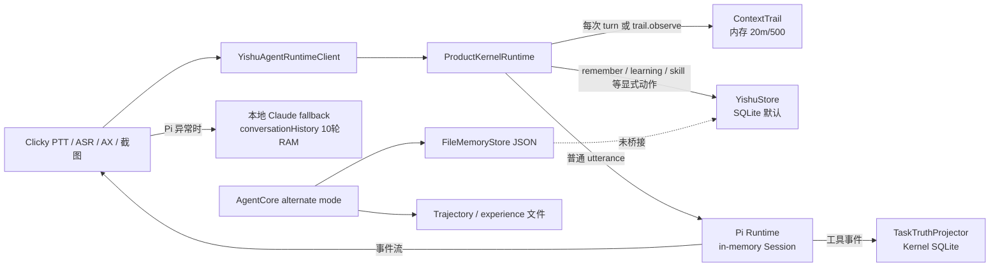

# 奕枢当前记忆、轨迹与上下文实现审计

审计日期：2026-08-08
范围：`apps/clicky`、`packages/kernel`、`packages/runtime`、`packages/agent-core` 及其产品/Agent Book 文档。本文只描述当前工作树中能从源码、数据文件和文档直接核对的事实。

标记说明：

- **已实现**：有源码和明确写入/读取路径；“已实现”不等于已通过完整产品验收。
- **文档声明**：只在文档中承诺，未在当前实现中找到对应闭环。
- **推断/缺口**：由已检查路径和检索结果得出的缺口，仍需在产品验收时补行为证据。

## 先给结论

当前不是四套都能互相读写的“同一个记忆系统”，而是四条职责不同、连接不完整的路径：

1. **Clicky / Yishu 壳**保留本次产品交互的语音、屏幕证据和最多 10 轮 RAM 对话历史；偏好写在 `UserDefaults`。这不是持久用户记忆，也不是 Pi 的会话存储。
2. **Kernel** 是唯一明确的产品持久证据所有者：SQLite（Clicky 默认）或 JSON / memory 后端保存 `MemoryClaim`、`Learning`、程序性 Skill、Mandate 与 `TaskTruth`。它现在由显式产品动作写入，不会在普通对话结束时自动抽取用户记忆。
3. **Pi** 是执行 harness。普通 Pi 对话只收到新鲜 `ContextFrame` 和当前 utterance；当前适配器的 `SessionManager.inMemory` 和进程内 `Map` 只提供进程内会话连续性，没有把 Kernel 的 `MemoryClaim` 注入 prompt，也没有在 Clicky Pi 路径落盘完整 turn/episode。
4. **Agent Core** 有一套独立的 JSON `MemoryCard`（四层）和完整 trajectory 文件，但它是 `YISHU_RUNTIME_MODE=agent-core` 的另一条 harness 路径，默认 runtime factory 没有传持久目录；缺少到 Kernel 的桥接。
5. **ContextTrail / ContextCapsule** 是短期、证据化上下文：Trail 只保留约 20 分钟、500 条、去截图字节；Capsule 是约 15 分钟的跨执行单元 handoff。它们不能代替跨会话长期记忆。

普通 Pi 对话的核对结果很明确：

- **不会读取 `MemoryClaim`**：`packages/runtime` 没有调用 `YishuStore.searchMemory` 或导入 `MemoryClaim`；Pi prompt 只序列化当前 frame 元数据和当前 utterance（`/Users/mahaoxuan/Documents/我的agent/packages/runtime/src/context-prompt.ts:19-33`）。
- **不会持久化完整 turn/episode**：Pi 的 `SessionManager.inMemory` 建在进程内；ProductKernelRuntime 只把“首次有工具/电脑动作”的 execution event 投影为 `TaskTruth`，普通 conversation 不生成 task（`/Users/mahaoxuan/Documents/我的agent/packages/runtime/src/pi-runtime-adapter.ts:532-577`；`/Users/mahaoxuan/Documents/我的agent/packages/runtime/src/task-progress.ts:82-123`；`/Users/mahaoxuan/Documents/我的agent/packages/kernel/src/task-truth.ts:154-162`）。
- **Clicky 的 10 轮 RAM history 与 Pi session 重复但不等价**：所有最终口播都会追加 `conversationHistory`，最多保留 10 轮；它仅在本地 fallback 调 Claude API 时作为 `conversationHistory` 发送，Pi 本身仍维护自己的进程内 session（`/Users/mahaoxuan/Documents/我的agent/apps/clicky/leanring-buddy/CompanionManager.swift:177-179,1484-1501,1624-1633`）。因此有两份临时上下文，没有一个跨会话真相源。
- **没有可见记忆管理面**（推断/缺口）：Kernel 有 `searchMemory` 和按 UUID 的 `forget` API，但在已检查的 Clicky 面板/路由中没有记忆列表、按自然语言检索、冲突解释或用户编辑入口；`forget` 只能接收 UUID（`/Users/mahaoxuan/Documents/我的agent/packages/kernel/src/actions/forget.ts:5-36`）。

## 实际数据流

对应接线证据：Clicky 启动 Node sidecar 时强制 `YISHU_RUNTIME_MODE=pi`、启用 product kernel，默认 SQLite，并把 store 目录放到 Application Support（`/Users/mahaoxuan/Documents/我的agent/apps/clicky/leanring-buddy/YishuAgentRuntimeClient.swift:127-155`）；ProductKernelRuntime 先把 frame append 到 Trail，再决定是产品 action 还是委托 inner runtime（`/Users/mahaoxuan/Documents/我的agent/packages/runtime/src/product-kernel-runtime.ts:20-25,46-58,87-115`）。

## 按组件审计

### 1. Clicky / Yishu：壳、临时上下文和 fallback history

| 项目 | 当前事实 | 生命周期 / 触发 | 检索入口 | 状态与风险 |
|---|---|---|---|---|
| `conversationHistory` | `(userTranscript, assistantResponse)` 数组 | `presentVoiceResponse` 每次完成口播后 append，超过 10 轮删最早；只在进程内 | `respondLocally` 转成 `historyForAPI` 发送给 Claude API | **已实现，但只是 RAM session cache**；不是 Kernel memory，也不由 Pi 读取 |
| `lastTranscript` / partial | Swift `@Published` 状态 | ASR 过程中和结束时更新 | UI / 当前 turn | **已实现、易失**；没有持久化语义 |
| model/cursor/onboarding | `UserDefaults` | 用户选择或开关时写入 | 启动时读取 | **已实现偏好**，不属于用户语义记忆 |
| ContextFrame | 当前 turn 可含最多 4 张 JPEG base64 截图、AX、window、pointer | 每次 voice turn capture；发送到 runtime | Pi prompt / Swift fallback | **已实现证据上下文**；未作为长期记忆保存 |
| background Trail sample | 每约 15 秒 metadata-only frame | `captureTrailSample` → `observeTrail` | Kernel Trail | **已实现短期采样**；无截图字节 |

证据：

- Voice timing 明确声明不保留 transcript、labels、screenshots 或 private content（`/Users/mahaoxuan/Documents/我的agent/apps/clicky/leanring-buddy/CompanionManager.swift:52-55`），但 `conversationHistory` 本身仍在内存中维护（同文件 `:177-179`）。
- fallback 明确把最多 10 轮 history 交给 Claude API（同文件 `:1484-1501`）；每次展示完成后 append 并裁剪（同文件 `:1624-1633`）。Pi 路径的完成结果也经过同一 `presentVoiceResponse`，所以这份数组不是“只在 fallback 生成”的第二份历史，而是“所有口播都积累、只有 fallback 读取”。
- 当前 voice turn 把完整 ContextFrame（包括截图）发送给 Node；background sample 则明确不含截图（`/Users/mahaoxuan/Documents/我的agent/apps/clicky/leanring-buddy/CompanionManager.swift:1338-1354,1357-1467`）。Collector 对 secure text field 不采 `valuePreview`，但 title/description 仍可进入 frame（`/Users/mahaoxuan/Documents/我的agent/apps/clicky/leanring-buddy/YishuContextFrameCollector.swift:20-70,73-89,225-240`）。

**隐私边界**：Trail 的 Kernel sanitizer 会去掉 screenshot base64，只留 `hasScreenshot` 和约 30 秒 metadata flag（`/Users/mahaoxuan/Documents/我的agent/packages/kernel/src/context/sanitize.ts:1-5,83-99,189-226,229-247`），但当前 turn 的截图仍会在 Swift→Node wire 和 Pi `session.prompt(...images)` 中短暂存在（`/Users/mahaoxuan/Documents/我的agent/packages/runtime/src/pi-runtime-adapter.ts:291-299`）。这不是“已落盘”，但仍是模型输入隐私面。

### 2. Kernel：产品持久证据层

`MemoryClaim` 的数据模型已经具备来源、捕获时间、作用域、置信度、最后确认时间、`supersedes`、tags 和 soft-retire 字段；同一 snapshot 还包括 `Learning`、候选/已验证 Skill、Mandate 和 TaskTruth（`/Users/mahaoxuan/Documents/我的agent/packages/kernel/src/store/types.ts:6-19,21-30,32-92`）。Clicky 默认使用 SQLite；createDefaultProductKernel 默认 backend 是 sqlite，可通过环境变量覆盖（`/Users/mahaoxuan/Documents/我的agent/packages/kernel/src/kernel.ts:50-69,109-128`）。SQLite schema 对应这些表，写入是同步 mutation（`/Users/mahaoxuan/Documents/我的agent/packages/kernel/src/store/sqlite-store.ts:23-49,435-499`）。

当前写入触发是显式产品动作，不是通用 turn collector：

- `remember` 校验 claim 后直接 `store.addMemory`，写入时 `source/capturedAt/scope/confidence/lastConfirmedAt/supersedes/tags` 全由输入决定；验证只是写后再次 search 该 claim（`/Users/mahaoxuan/Documents/我的agent/packages/kernel/src/actions/remember.ts:6-21,25-61`）。
- `record_learning` 只把用户 correction 作为 `Learning` append（`/Users/mahaoxuan/Documents/我的agent/packages/kernel/src/actions/record-learning.ts:6-36`）。
- `remember_how` 从最近 Trail 提取 `SkillCandidate`，可用 trail replay 验证后 promote 为 `VerifiedSkill`；没有验证通过时仍保存 candidate（`/Users/mahaoxuan/Documents/我的agent/packages/kernel/src/actions/remember-how.ts:52-129,131-167`）。
- `forget` 是按 UUID soft-retire；没有按自然语言、claim 内容或冲突组删除（`/Users/mahaoxuan/Documents/我的agent/packages/kernel/src/actions/forget.ts:5-36`）。
- utterance router 只识别“记住事实 / 记住做法 / 记录规则 / handoff”等高精度短语；普通问题返回 null，交给 Pi；“忘掉”因为缺 UUID 直接返回 null（`/Users/mahaoxuan/Documents/我的agent/packages/kernel/src/utterance-router.ts:21-47,82-107,110-133`）。

检索是最小 keyword 入口：只支持 `scope`、`minConfidence` 过滤，按 token overlap 后按 confidence、`lastConfirmedAt` 排序；没有 embedding、时间/事件/实体关系查询或自动 prompt 注入（`/Users/mahaoxuan/Documents/我的agent/packages/kernel/src/store/types.ts:109-112`；`/Users/mahaoxuan/Documents/我的agent/packages/kernel/src/store/yishu-store.ts:111-122,192-225`；SQLite 同样见 `/Users/mahaoxuan/Documents/我的agent/packages/kernel/src/store/sqlite-store.ts:88-117`）。

`supersedes` 只是可写字段，当前 `addMemory` 是无去重 append；没有 Mem0 式 ADD/UPDATE/DELETE/NOOP，也没有过期、重要性评分、版本链查询或后台 curator。JSON `parseSnapshot` 还只做数组类型 cast，不做字段/版本 schema 校验（`/Users/mahaoxuan/Documents/我的agent/packages/kernel/src/store/yishu-store.ts:95-108`）。这意味着冲突可写入两条 active claim，后续 search 只是排序，不会替用户判定新旧。

TaskTruth 是 Kernel 的另一类 durable state，而非 conversation memory：Projector 要求首个 execution signal 为 `start`，工具未启动的普通对话不生成 task；终态不能被迟到事件覆盖，并对标题/evidence 做长度和敏感材料脱敏（`/Users/mahaoxuan/Documents/我的agent/packages/kernel/src/task-truth.ts:28-69,87-107,154-193`）。它证明的是任务生命周期，不是完整 episode transcript。

ContextTrail 同样是 Kernel 内存而非持久记忆：默认 max 500、retention 20 分钟、screenshot metadata TTL 30 秒；append/query/prune 只在内存数组上运行（`/Users/mahaoxuan/Documents/我的agent/packages/kernel/src/context/trail.ts:1-5,15-22,39-59,61-85,125-157`）。

### 3. Runtime / Pi：普通对话的实际边界

Pi adapter 按 capability/provider/generation/model 复用进程内 `AgentSession`，并明确使用 `SessionManager.inMemory`；dispose 时清掉所有 session（`/Users/mahaoxuan/Documents/我的agent/packages/runtime/src/pi-runtime-adapter.ts:109-123,532-577,399-422`）。`buildGroundedPrompt` 只放新鲜 ContextFrame（去掉 image bytes 的 metadata）和当前 utterance（`/Users/mahaoxuan/Documents/我的agent/packages/runtime/src/context-prompt.ts:1-33`）。在 `packages/runtime/src` 中没有 `MemoryClaim`、`searchMemory` 或 store 注入路径；因此普通 Pi turn 不读取 Kernel memory。

ProductKernelRuntime 的分支是：先把 live frame append 到 Trail；若 utterance 命中 product route，则直接执行 Kernel action；否则交给 inner Pi/AgentCore，并把 runtime events 交给 `RuntimeTaskProgressTracker`（`/Users/mahaoxuan/Documents/我的agent/packages/runtime/src/product-kernel-runtime.ts:87-115`）。Tracker 只监听 `tool.started` / `computer.action.requested` 才建立 task；response.completed 对纯 conversation 会直接结束而不持久化，且持久化的 evidence 只含安全 event id/tool metadata（`/Users/mahaoxuan/Documents/我的agent/packages/runtime/src/task-progress.ts:22-53,82-141`）。

所以“普通 Pi conversation 是否持久化完整 turn/episode”的答案是：**当前 Clicky 主路径没有**。事件通过 stdio stream 回到 Swift，但没有在 runtime adapter 中写 transcript/episode 文件；Pi 的 session 是进程内，Clicky 的 history 是最多 10 轮内存，Kernel 只可能有 execution TaskTruth。`packages/runtime/src/pi-runtime-adapter.ts:249-279,342-348` 也显示完成事件只发 `text/verified/verifier`，不是完整会话存储。

### 4. Agent Core：另一套未桥接的记忆和轨迹

Agent Core 的 `FileMemoryStore` 定义 `working|session|long_term|profile` 四层 `MemoryCard`，JSON load/save，`add` 默认 `session`、立即写盘，search 是 keyword overlap + layer rank，promote 只改 layer（`/Users/mahaoxuan/Documents/我的agent/packages/agent-core/src/memory/store.ts:5-47,63-106,112-190`）。模型必须显式调用 `memory_write`、`memory_search`、`memory_promote`；工具输出会把完整 card JSON 放回 ReAct messages（`/Users/mahaoxuan/Documents/我的agent/packages/agent-core/src/tools/builtin.ts:256-378`）。

它没有自动把 memory 注入每个 turn：`YishuAgent.run` 的 base messages 只有 system + user task，之后才依赖工具调用（`/Users/mahaoxuan/Documents/我的agent/packages/agent-core/src/harness.ts:187-246`）；ReAct loop 只在模型实际调用 `memory_search` 时计数 memory hits（`/Users/mahaoxuan/Documents/我的agent/packages/agent-core/src/loop/react.ts:48-53,79-121`）。该 store 也不认识 Kernel `MemoryClaim`、source/confidence/supersedes/retiredAt。

Agent Core 会把完整 trajectory 落到 `<id>.json`，旁边写 learning signal、experience JSONL、verify 和 skill draft metadata（`/Users/mahaoxuan/Documents/我的agent/packages/agent-core/src/harness.ts:367-464`；默认 data 路径见同文件 `:467-487`）。trajectory recorder 把 `task`、每一步 `data` 和结果原样放进 JSON（`/Users/mahaoxuan/Documents/我的agent/packages/agent-core/src/trajectory/recorder.ts:11-47`），因此它是稽核/经验证据，不能自动等同长期用户记忆；`extractLearningSignal` 也只产工具/成败 lessons，并不写 Kernel `Learning` 或 `MemoryClaim`（`/Users/mahaoxuan/Documents/我的agent/packages/agent-core/src/evolution/learning-signal.ts:5-13,89-140`）。

但 Clicky 默认不是这条路径：runtime factory 默认 `pi`；只有环境指定 `agent-core` 才构造 AgentCoreRuntime（`/Users/mahaoxuan/Documents/我的agent/packages/runtime/src/runtime-factory.ts:8-18,38-55`）。而 AgentCoreRuntime 若没有同时传入 workspace/memory/trajectories 三个路径，就为每个 runtime 创建 temp root 下的 memory/trajectory，dispose 时递归删除（`/Users/mahaoxuan/Documents/我的agent/packages/runtime/src/agent-core-runtime.ts:97-128,244-251`）。当前 factory 没有传这些 options，故这条 alternate mode 默认也不是跨进程持久记忆。

仓库现有 `/Users/mahaoxuan/Documents/我的agent/packages/agent-core/data/memory.json` 里可看到重复的同一偏好（多条 `tokyonight`，新旧 layer 混杂）。这是真实数据对“append + promote、无冲突合并”的反例证据，而非推断；它也和 agent-book 对 append-only 与 evolving 的区分相符。

## 普通 Pi、Clicky history 与完整 episode 的关系

| 路径 | 会话连续性 | 磁盘事实 | 是否读 Kernel MemoryClaim | 是否是完整 episode |
|---|---|---|---|---|
| Clicky → Pi | Pi `AgentSession` 在同一 sidecar 进程复用 | 当前 adapter 没有 transcript 文件写入 | 否；prompt 只有 frame + utterance | 否；只有事件流 |
| Clicky → local fallback | `conversationHistory` 最多 10 轮 RAM | 未见 transcript 文件写入 | 否 | 否；把 history 传给 API 后仍只在内存 |
| Product actions | Kernel ActionRegistry receipt | MemoryClaim/Learning/Skill 等 SQLite durable | Action 自己读写 store | 不是 episode；是结构化事实/程序证据 |
| Pi execution turn | Runtime tracker 观察工具事件 | `TaskTruth` durable，evidence 安全且有界 | 不读 | 不是 episode；是任务状态投影 |
| AgentCore alternate | `YishuAgent` 内部消息+工具循环 | 显式持久目录时有 raw trajectory；默认 runtime 临时目录并在 dispose 删除 | 否；独立 `MemoryCard` | trajectory 可接近完整 run，但不等于用户 memory |

## 冲突、删除、检索和 UI 缺口

1. **冲突/更新**：Kernel schema 有 `supersedes`，但 add/search 不会找相似 claim、决定更新或标记旧版本；两条相反 claim 可同时 active。AgentCore `MemoryCard` 没有 supersedes、source、confidence、retiredAt，也没有 delete API。现有数据的重复 `tokyonight` 卡证明不会自动合并。
2. **删除/撤销**：Kernel 只有 UUID soft-retire；没有按 claim、scope、自然语言或一组冲突版本撤销的用户路径。AgentCore 只有 promote，没有 memory delete。Mandate revoke 是另一类授权资源，不等于删记忆。
3. **检索**：Kernel 与 AgentCore 都是 token overlap；Kernel 可按 scope/minConfidence，AgentCore 可按 layer；均无 embedding/hybrid/time/entity/event retrieval。Kernel 任何自动读入普通 Pi 的路径尚未接线。
4. **完整历史**：Pi session 只在 sidecar 进程，Clicky history 只保留 10 轮；AgentCore trajectory 才有 raw task/steps，但默认 alternate runtime 是 ephemeral。当前不存在“所有普通语音 turn → append-only episode store → 离线提炼”的 Clicky 主路径。
5. **用户控制面**（推断/缺口）：已检查的 Clicky `CompanionManager`、runtime client、产品 action surface 没有 memory browser、claim detail、冲突比较、版本回滚或自然语言 forget UI。内核 API 已有 search/retire，但没有把这些 API 暴露为可见产品面。
6. **隐私**：TaskTruth projector 对标题/evidence 做敏感材料替换，ContextTrail 去截图字节；但 AgentCore trajectory 将 task、tool-call arguments 和结果写原始 JSON，Skill draft 还把 task preview 写进 Markdown（`/Users/mahaoxuan/Documents/我的agent/packages/agent-core/src/evolution/skill-draft.ts:84-123`）。Clicky turn screenshot/AX title/description 在模型输入中仍可能含个人内容，需在“是否允许进入 memory extractor”之前建立单独脱敏和批准边界。

## 与《AI Agent Book》记忆模型的对照

以下是本地书稿的架构依据，不是本次在线产品核验；书中引用的 OpenClaw、Claude Code、Hermes、Mem0、Memobase 仍应由主线另做在线复核。

| 书中原则 | 书稿证据 | 当前实现 | 判定 |
|---|---|---|---|
| 记忆不是原始 transcript，而是选择性、抽象、结构化提取 | `/Users/mahaoxuan/Desktop/AI产品经理/ai-agent-book/book-zhtw/chapter3.zhtw.md:15-20,33-43` | Clicky 普通 turn 没有 extractor；只有显式 `remember` 或 AgentCore 显式 `memory_write` | **缺口** |
| 轨迹 append-only；长期记忆跨会话重写/合并/淘汰 | `/Users/mahaoxuan/Desktop/AI产品经理/ai-agent-book/book-zhtw/chapter3.zhtw.md:74-88,120-124` | AgentCore trajectory 可落盘，但 Clicky Pi 普通 turn 不落盘；Kernel claim 只 append/soft-retire | **部分** |
| Working memory 是动态激活子集；长期类型包括 episodic/semantic/procedural | `/Users/mahaoxuan/Desktop/AI产品经理/ai-agent-book/book-zhtw/chapter3.zhtw.md:192-208,232-237` | Trail 是短期 working evidence；Kernel 有 semantic claim/procedural Skill；缺长期 episodic event 和动态 memory assembly | **部分** |
| Mem0 ADD/UPDATE/DELETE/NOOP；Memobase profile + event memory | `/Users/mahaoxuan/Desktop/AI产品经理/ai-agent-book/book-zhtw/chapter3.zhtw.md:214-237` | Kernel 没有候选相似检索、冲突决策、profile slot/event store；AgentCore 只有 keyword cards | **缺口** |
| 重要性、聚类摘要、抽象、版本冲突与归档 | `/Users/mahaoxuan/Desktop/AI产品经理/ai-agent-book/book-zhtw/chapter3.zhtw.md:239-251` | 没有 importance/decay/cluster/curator/version query；`supersedes` 仅手工字段 | **缺口** |
| 线上保存不可变证据，离线整理/验证/审批/回滚 | `/Users/mahaoxuan/Desktop/AI产品经理/ai-agent-book/book-zhtw/chapter8.zhtw.md:80-94,287-307,360-366` | AgentCore 有 trajectory/signal/verify/skill-draft；没有从证据到 Kernel memory 的 gated promotion；Clicky Pi 无 episode evidence | **部分，未闭环** |
| 可编辑、有界、可回滚的用户控制面 | OpenClaw `MEMORY.md` / dated logs：`/Users/mahaoxuan/Desktop/AI产品经理/ai-agent-book/book-zhtw/chapter5.zhtw.md:64-76`；Claude Code/Hermes：`/Users/mahaoxuan/Desktop/AI产品经理/ai-agent-book/book-zhtw/chapter8.zhtw.md:309-317` | Kernel 仅 API；Clicky 未见 memory UI；AgentCore JSON 可编辑但没有产品面和冲突语义 | **缺口** |
| 持久记忆是提示注入和隐私风险放大器 | `/Users/mahaoxuan/Desktop/AI产品经理/ai-agent-book/book-zhtw/chapter5.zhtw.md:94-108`；日志脱敏原则见 `chapter3.zhtw.md:253-261` | TaskTrail/TaskTruth 有脱敏；MemoryClaim/AgentCore `memory_write` 没有统一 content review/PII policy | **部分** |

## 当前架构中最重要的重复与错位

- **两个临时会话缓存**：Pi `AgentSession` 是 sidecar 内的模型上下文；Clicky `conversationHistory` 是 Swift 内最多 10 轮、仅供 fallback API 的上下文。它们没有共享 ID、没有一致的裁剪/摘要/删除策略，也没有向 Kernel 提交 episode。
- **两套长期“记忆卡”**：Kernel `MemoryClaim` 与 AgentCore `MemoryCard` 字段、作用域和读取工具不同，不能互相搜索或覆盖；产品默认走 Kernel + Pi，不会自动看到 AgentCore `data/memory.json`。
- **轨迹与学习信号错位**：AgentCore 将 raw trajectory、signal、skill draft 写在自身 data 目录，但 learning signal 不会进入 Kernel `Learning`；Pi 主路径甚至不保存 raw trajectory。
- **TaskTruth 与 memory 混淆风险**：TaskTruth 只回答任务是否 running/done/blocked/failed/cancelled；它不保存用户偏好、事件、关系或完整对话。把它称为“持久对话记忆”会掩盖真实缺口。

## 建议的下一步（先定系统，不先让用户选 transcript/summary）

下一步应先冻结五种对象的产品契约，再实现单一写入/读取编排：

1. **Working context**：ContextFrame/ContextTrail，带来源、时间、置信度、TTL，只服务当前注意力。
2. **Episodic memory**：经批准的结构化事件（谁、何时、发生什么、来源 turn/observation），可按时间/任务/主题检索；raw transcript/trajectory 作为独立稽核层，不直接当长期记忆。
3. **Semantic memory**：`MemoryClaim`/profile，具有类型、scope、source、confidence、validity、supersedes/version 和明确 ADD/UPDATE/DELETE/NOOP 决策。
4. **Procedural memory**：VerifiedSkill，必须由多次或一次可验证轨迹产生候选，再经 replay/人工门控进入正式 Skill。
5. **TaskTruth / business state**：只保存任务阶段和可见结果，不承担记忆语义。

这正对应书中“轨迹（证据）→ 选择性提取 → 对比更新 → 验证/审批 → 分层检索/修剪”的主线。实现顺序应是：先给 Kernel 增加统一 memory event/claim contract 与 read assembly，再把 Clicky/Pi 的普通 turn 接入“本地脱敏、候选抽取、可回滚批准”流水线；最后再做 UI 和在线竞品复核。这样可以避免把 Clicky、Kernel、Yishu、Pi 的临时缓存误当成一套已经完成的持久记忆。

## 当前文档的漂移

- 产品文档明确规定“Yishu 拥有 identity、relationship memory、initiative、permissions、task truth；Pi 拥有 model/session/stream/tool loop”（`/Users/mahaoxuan/Documents/我的agent/docs/product-kernel.md:32-38`；`/Users/mahaoxuan/Documents/我的agent/docs/architecture.md:42-49`），这与当前 ownership 方向一致。
- `docs/product-kernel.md:65-91` 已正确记录 Kernel evidence store、Trail 和 TaskTruth；但没有普通对话的 episode/memory extraction 生命周期。
- `docs/clicky-integration.md:81-90` 仍把“durable conversation memory、initiative、task progress”列作 Next, Unify。TaskTruth 现在已有 execution projection，所以这句对 task progress 已部分过时；对 durable conversation memory 仍然准确，不能当完成证据。
- `docs/agent-book/CAPABILITY_MAP.md:155-177` 把 Ch3 分层用户记忆标成“已有（agent-core，文件级）”。这只证明 alternate agent-core harness 的 JSON cards 存在，不能证明 Clicky/Pi 产品路径已接入；其 `:118-120` 也明确记忆操作是显式 `memory_write/search/promote`。
