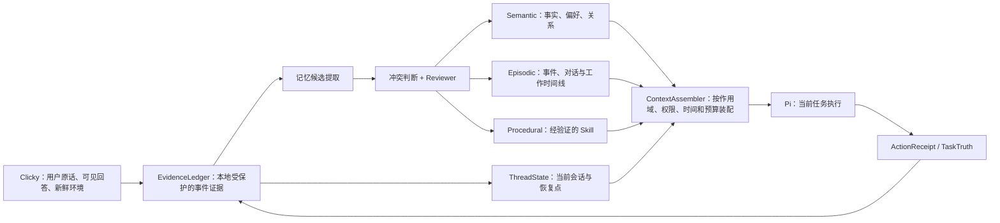

# 奕枢持久记忆系统：研究结论与产品方案

Type: research
Status: historical
As-of: 2026-08-09

> 状态：架构基线；P1 持久真相底座已实现，完整记忆产品尚未闭环
>
> 核对日期：2026-08-08
> 依据：《深入理解 AI Agent》第 3 章、当前奕枢源码审计、同类产品与 Agent 框架官方资料

## 结论

之前把问题问成“保存逐字 transcript，还是只保存摘要”是不成立的。它把四个不同问题混在了一起：

1. 是否保留可追溯的原始证据；
2. 模型当前应该看到多少内容；
3. 哪些信息值得成为跨会话长期记忆；
4. 数据保存多久、谁能看、如何彻底忘记。

书和同类产品给出的共同答案不是二选一，而是**分层**：

- 原始轨迹是可审计的证据，不等于长期记忆；
- 对话摘要和事件记录用于按需找回细节；
- 少量稳定事实、关系和偏好进入结构化长期记忆；
- 经验证的行为流程进入程序记忆；
- 当前任务状态单独保存，不能混进“用户画像”；
- 每轮只把与当前问题、作用域和权限相关的少量内容交给执行器。

因此，奕枢的目标不应是一份越来越长的“总摘要”，而应是一套**有来源、有作用域、有版本、有用户控制的记忆系统**。

## 先把名字收拢

用户只需要认识一个产品：**奕枢**。其余名称是内部职责，不应成为用户理解产品的前提。

| 产品语言 | 代码名称 | 承担什么 | 不承担什么 |
| --- | --- | --- | --- |
| 奕枢 | Yishu | 唯一用户可见身份与整个产品 | 不是某一个 package |
| 奕枢 Mac 客户端 | Clicky / `apps/clicky` | 语音、光标、屏幕上下文、权限、设置和可见控制面 | 不做长期记忆真相源 |
| 奕枢内核 | Kernel / `packages/kernel` | 记忆、关系、规则、授权、技能和任务真相 | 不替模型执行复杂任务 |
| 任务执行器 | Pi / `packages/runtime` | 模型会话、工具循环、流式输出、取消和实际执行 | 不拥有奕枢身份和长期记忆 |
| 书本实验层 | `packages/agent-core` | 验证《AI Agent Book》的通用 Agent 机制 | 不是第二个产品，也不是正式记忆库 |

最短关系是：

```text
奕枢（产品） = Mac 身体（Clicky） + 产品内核（Kernel） + 任务执行器（Pi）
```

## 书里真正讲了什么

已定位到当时使用的《深入理解 AI Agent：设计原理与工程实践》，作者 Bojie Li，正式上游为 [`bojieli/ai-agent-book`](https://github.com/bojieli/ai-agent-book)。记忆系统集中在[第 3 章“用户记忆和知识库”](https://github.com/bojieli/ai-agent-book/blob/main/book/chapter3.md)。

### 三套正交分类

| 书中的问题 | 分类 | 对奕枢的意义 |
| --- | --- | --- |
| 放在哪里 | 轨迹、用户长期记忆、业务状态 | 对话证据、用户记忆、TaskTruth 不能混成一张表 |
| 怎么存 | Simple Notes、Enhanced Notes、JSON Cards、Advanced JSON Cards | 关键关系用带来源、人物、关系、时间的结构化卡片；大量细节不必常驻 |
| 存什么 | 情景、语义、程序记忆 | “上次发生什么”“用户有什么稳定偏好”“以后怎样做”是三类对象 |

原书明确说，用户记忆不是记录用户说过的每一句话，而是主动、持续地提取、压缩和结构化，形成一个可检查的用户模型。同时，轨迹仍然作为按时间追加的原始事件记录，是否长期保留由产品的数据保留与审计要求决定。两者分别是“流水账”和“档案”。

### 双层读取

原书最终收敛到两条互补路径：

- 少量关键的 Advanced JSON Cards 形成“概览”，让 Agent 每次都知道核心事实和关系；
- 大量历史对话、事件和文档留在上下文之外，通过带来源和时间的检索按需提供“细节”。

这意味着“保存”和“每次给模型看”必须是两个不同策略。完整历史可以作为受保护证据存在，但不能整份塞进 prompt；结构化记忆可以长期存在，但必须能回到证据核验。

### 两种更新节奏

书要求同时存在：

- **增量更新**：及时吸收用户明确要求、纠正和新证据；
- **定期整理**：从全量知识和原始证据中去重、去旧、合并、补漏、重组和限定适用场景。

更新不是让同一个模型静默覆盖旧字符串。原书建议由 Proposer 根据证据提交变更，再由独立 Reviewer 审核后合并并重建派生索引。旧证据仍可追溯。

## 同类产品已经形成的共识

官方资料显示，主流产品正在把“记忆”拆成多个用户合同，而不是一个开关：

| 产品 | 关键做法 | 奕枢应该吸收什么 |
| --- | --- | --- |
| ChatGPT | Saved memories 与 Reference chat history 分开；支持 project-only 与 Temporary Chat | 长期事实和历史检索分开；项目边界是硬隔离 |
| Claude | 分类记忆条目实时更新；过去聊天用 RAG 搜索并回链原聊天；项目独立；Incognito 不读不写 | 记忆可见、可编辑、可导出，使用时能看来源 |
| Gemini | 以 Activity 为历史底座；Memory、Instructions、Connected Apps 分开控制 | 连接器、历史与派生记忆的删除关系必须说清 |
| Copilot | Saved memory、历史推断、custom instructions 和 Temporary Chat 分开 | 同一“记忆”名称下也要拆数据归属和保留策略 |
| Perplexity Computer / Brain | 从任务、文件、连接器、修正中形成带来源的工作图，标记变化与 stale；Brain 不执行动作 | 长期工作图与执行权限分离，最接近奕枢的桌面 Agent 边界 |

可核对的官方入口包括 [OpenAI Memory controls](https://help.openai.com/en/articles/11146739-how-does-reference-saved-memories-work)、[Claude chat search and memory](https://support.claude.com/en/articles/11817273-use-claude-s-chat-search-and-memory-to-build-on-previous-context)、[Gemini personalization with memory](https://support.google.com/gemini/answer/16598469?co=GENIE.Platform%3DDesktop&hl=en) 和 [Perplexity Brain](https://www.perplexity.ai/help-center/en/articles/19700001-what-is-brain)。

框架层也有相同收敛：Letta 用少量 always-on memory blocks 加大量 archival retrieval；LangGraph 把 thread checkpoint 与跨线程 Store 分开；Mem0 先抽取候选，再与相似旧记忆做 ADD / UPDATE / DELETE / NOOP 或版本化冲突处理。这些是可吸收的机制，不应成为新的产品身份或外部依赖前提。

## 当前奕枢的真实状态

截至 2026-08-08，**持久对话真相底座已经建立，但持久记忆闭环尚未完成**：

- Clicky 现在持久保存稳定的 `conversationId`；每个 request ID 就是 turn ID，取消复用原 trace ID。它原有最多 10 轮的 `conversationHistory` 仍只供本地 fallback 使用，重启即失效，尚未删除。
- Pi 仍用进程内 session 保持执行连续性，但它和 Clicky 的短历史都不再承担产品真相；`ProductKernelRuntime` 把普通对话、产品动作和安全 typed event 统一投影到 Kernel。
- Kernel 的 JSON / SQLite / 内存后端已有 `Conversation`、`Turn`、`Event` 账本，支持旧库迁移、事件顺序、幂等冲突、终态单向、重启读取和终态重放。
- 新 turn 在调用 Pi 或产品动作前先落为 open；已经完成的 request 重放持久结果而不重新执行，遗留 open turn 则以 `recovery_required` 失败关闭。
- 账本只保留用户可见输入、最终回答和安全字段白名单；流式 delta、工具参数、截图、音频、隐藏推理、凭据和任意嵌套 payload 不落盘。
- Kernel 的 `MemoryClaim` 已有 `source`、`capturedAt`、`scope`、`confidence`、`supersedes` 和 soft-retire，是长期事实的雏形。
- `MemoryClaim` / `Learning` 写入现在会在落库前拒绝凭据、JWT、data URI、截图载荷和赋值形式的隐藏内容；但还没有旧数据隔离/修复界面。
- 目前只有显式“记住”类产品动作写 `MemoryClaim`；普通 Pi 对话结束后不会自动提取记忆。
- 普通 Pi turn 不读取 Kernel 的 `MemoryClaim`，prompt 里只有当前 `ContextFrame` 和本次 utterance。
- `ContextTrail` 只在内存中保留约 20 分钟的去截图字节元数据；`ContextCapsule` 也是短期交接包，都不是长期对话记忆。
- `agent-core` 有独立 JSON MemoryCard 和 trajectory，但默认正式路径走 Pi；这套数据没有桥接到 Kernel，不能当产品记忆。
- 当前没有记忆列表、来源查看、冲突比较、自然语言忘记、项目隔离或导出入口。
- 当前检索只是关键词匹配；`supersedes` 可以写但没有自动冲突判断，普通对话也不会把结果注入下一轮。

所以现状已经从“多个临时缓存、没有共同真相”推进为“有一个持久事实底座”；仍缺的是**历史恢复控制面、记忆提取管线、读取装配、作用域隔离和用户控制**。这次完成的是大一统的地基，不是完整记忆体验。

## 奕枢的目标记忆系统



### 六个产品对象

| 对象 | 保存什么 | 生命周期 | 是否默认给 Pi |
| --- | --- | --- | --- |
| Live Context | 当前屏幕、AX、光标、语音 turn | 秒到分钟 | 当前任务需要时 |
| EvidenceLedger | 用户文本、可见回答、typed 工具事件和可验证结果 | 本地、有限保留、可审计 | 否，只按需取证 |
| ThreadState | 当前会话消息、任务 checkpoint、审批和恢复点 | 会话/任务级 | 当前 thread 是 |
| Episodic Memory | 发生过的事件、对话摘要、决定、人物和时间线 | 可检索、可过期 | 否，按需召回 |
| Semantic Memory | 稳定事实、偏好、关系和约束 | 版本化，直到失效/忘记 | 少量核心常驻，其余按需 |
| Procedural Memory | 经验证、可回放、可回滚的 Skill | 版本化 | 仅匹配任务时 |

`TaskTruth` 继续单独回答“任务现在是什么状态”；`ContextCapsule` 是从这些对象中为当前执行器生成的短期投影，不是第七个长期数据库。

### 写入规则

1. 用户明确说“记住”：走热路径，生成可见 receipt；低敏内容可立即生效，敏感类别仍需过滤或确认。
2. 用户纠正奕枢：新证据优先，旧 claim 进入 `superseded`，不能无痕覆盖。
3. 普通对话：后台只生成 candidate；经过作用域、敏感、重复、冲突和证据检查后再生效。
4. 任务完成：只有可验证 receipt 能生成任务事件；模型说“完成了”不能成为事实。
5. 行为学习：一次成功最多生成 SkillCandidate；经 replay、Reviewer 和 eval 后才成为 VerifiedSkill。
6. 密码、token、一次性码、原始截图、原始音频和隐藏推理默认不进入长期记忆。

### 读取规则

1. 先绑定 `user / project / task / app` 作用域，再检索；执行器不能自己猜 namespace。
2. 先过滤权限、敏感级别、有效时间和 `active / disputed / retired` 状态，再做关键词、向量、实体和时间混合召回。
3. 少量“核心用户卡片”常驻；历史细节和事件按需检索，不能把整个 transcript 注入。
4. 每个召回结果带 `source_event_ids`、时间、作用域和当前有效性；影响外部动作时必须回到新鲜观察核验。
5. 用户应能看到“这次回答用了哪条记忆、来自哪里”，并可当场纠正或忘记。

### 更新与删除规则

每条记忆至少需要：`kind`、结构化内容、来源事件、主体/关系、namespace、创建与有效时间、confidence/status、sensitivity/consent、retention 和版本关系。

状态至少包括：`candidate → active → superseded / disputed / retired`。索引和“核心用户卡片”都是可重建派生物，不能成为唯一真相。

删除需要比竞品更清楚：

- 删除一段源对话时，默认撤销只由它支撑的派生记忆；多来源记忆保留剩余来源并重算置信度。
- 删除一条 Memory 时，立即从默认检索、核心卡片和派生索引中移除；界面同时提供“连同来源一起删除”。
- Temporary / 私密会话既不读取已有长期记忆，也不写入新的长期记忆。
- 删除动作产生可验证 tombstone，防止缓存或旧索引再次召回。

### 建议的本地隐私默认值

- 只把**用户文本、奕枢可见回答和经过净化的 typed event/receipt**写入本地 EvidenceLedger；原始音频、截图和隐藏推理不持久化。
- EvidenceLedger 有有限保留期并可配置；首版以保守本地保留为默认，而不是上传云端或永久保存。
- 结构化长期记忆只有在通过敏感过滤、作用域和证据检查后才生效。
- 所有记忆发送给 Pi 或其他执行单元前都经过最小化装配；凭据使用专门的临时注入通道，绝不进入记忆。

## 实现顺序

### P0：冻结记忆契约与评估集

- 定义 Evidence、ThreadState、Episode、MemoryClaim、Skill、TaskTruth 的 schema 和边界；
- 给 `MemoryClaim` 增加 kind、source refs、subject/relationship、validity、status、sensitivity、retention；
- 先写基础回忆、多会话、主动服务、冲突、隔离、敏感信息和删除合规 fixtures。

### P1：建立唯一的会话/事件真相源

已完成的底座：

- Kernel SQLite / JSON / 内存后端增加产品拥有的 conversation / turn / event 存储；
- Clicky 和 Runtime 使用同一 `conversationId / turnId / traceId` 契约；
- Clicky 短历史与 Pi session 明确降为缓存，不再是持久真相；
- 普通对话、产品动作、工具状态和 visible receipt 进入经过净化的 EvidenceLedger；
- 支持重启后从 Kernel 读取并重放已结束 turn，不依赖供应商 session；
- 产品动作的取消信号贯穿 Kernel，并有明确 commit 边界：commit 前取消不留副作用；commit 后才收到取消时，保留真实动作 receipt、将 turn 标成 `action_committed_after_cancel` 失败，且不播报成功。

P1 尚未完成的产品面：

- Clicky 还没有浏览、继续或恢复 Kernel 历史会话的入口；
- 尚未把 Kernel 历史装配回新 turn 的 prompt，因此“记录下来”不等于“下轮自动记起”；
- 尚未实现 EvidenceLedger 保留期；
- Clicky 的 10 轮 fallback 缓存尚未退役。
- 当前正式并发边界是单 Clicky、单 SQLite sidecar；跨 Runtime exactly-once
  仍需 durable lease，JSON 也不能由多个独立进程同时写。

P1.1 已补齐记忆前置的作用域边界：

- conversation / turn / TaskTruth 共享同一个 `personal | project | private`
  作用域，项目用稳定 UUID 隔离；
- 明确事实和 Learning 写入 `personal` 或 `project:<UUID>`，不再默认
  `global`；
- private 只在当前运行时处理，不读写记忆，不落 conversation / turn /
  ContextTrail / TaskTruth，也不跨重启恢复；
- 作用域切换必须新建 conversation，Clicky fallback 和 Pi session 不会跨域复用。

### P2：打通长期记忆写入和读取

- 显式记住走热路径，普通对话走后台 candidate；
- 实现去重、版本、冲突、supersede、disputed 和 reviewer；
- 建立少量核心卡片 + scoped episodic retrieval；
- 在每个普通 Pi turn 前由 Kernel 生成带来源的 ContextCapsule。

### P3：给用户真正的控制面

- Memory Center：按“关于我 / 项目 / 事件 / 做法”浏览；
- 查看来源、为何使用、有效期和冲突；
- 编辑、忘记、级联删除、导入/导出；
- 项目列表、历史切换和 private 会话的可见管理。

### P4：整理、工作图与程序学习

- 增量更新 + 定期 Proposer/Reviewer 整理；
- 从事件、文件、人物、决定和开放环节形成带来源的工作图；
- 经验证轨迹生成 SkillCandidate，回放/eval 后晋升；
- 低频、过期和失败记忆降权、归档或退役。

## 验收标准

至少要用完整用户路径证明：

1. 重启应用后，奕枢能在正确作用域回忆已确认偏好，并显示来源；
2. “我住在北京”之后“我搬到上海”，当前回答使用上海，历史仍能解释北京曾经成立；
3. A 项目的决定不会出现在 B 项目；
4. 私密会话不读取、不写入、不进入索引；
5. 删除源对话后，唯一依赖它的记忆和索引不可再召回；
6. 密码、token、截图文本和未验证工具结果不能成为长期记忆；
7. 纯对话不会伪造 TaskTruth，工具成功也不会被误记为任务完成；
8. 记忆命中、冲突、时间推理、主动提醒、越权泄露、删除合规和延迟都有可重复的评估结果。

## 配套证据

- [《AI Agent Book》记忆模型摘录与映射](./ai-agent-book-memory.md)
- [Agent 记忆架构调研](./agent-memory-architectures.md)
- [同类个人 Agent 记忆机制基准](./product-memory-benchmarks.md)
- [奕枢当前记忆、轨迹与上下文实现审计](./yishu-memory-current-state.md)
- [Screenpipe 对奕枢的适配判断](./screenpipe-fit.md)
