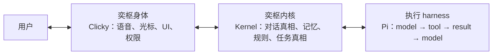

# 02 整体架构

Type: wiki
Status: current
Verified: 34c0eaa 2026-08-15
Review: apps/ 或 packages/ 结构、ownership、数据流变化时

## 总览图

```text
                Yishu single macOS application
     apps/clicky —— 正式 Clicky 源码与安装源
 cursor | panel | PTT | StepFun ASR | streamed response | MiniMax TTS
                            |
              Clicky CompanionManager（编排器）
     identity | relationship | cancellation | presentation
               /                            \
  本地点击快路径                        复杂 turn
  Vision OCR → AXPress / 受护栏的 Quartz   |
        |              YishuContextFrameCollector
        |                       |
        |              ContextFrame（NOW，30s 有效期）
        |                       |
        |         packages/kernel 产品层
        |         ContextTrail（近期现场，无截图字节）
        |         YishuActionRegistry + YishuStore
        |         remember | remember_how | share_context | ...
        |                       |
        |           /          |           \
        |       本地        PiRuntime     委托/外部
        |    (store/AX)    Adapter       (handoff capsule)
        |                       |
        |           verify → ActionReceipt / presence
        \_______ verified presentation ______/
```

产品主线一句话（ADR 0010 统一产品脊柱）：

```text
Clicky 身体 → 版本化协议 → Kernel 产品真相/动作 → Runtime 适配器 → verified receipt → 可见呈现
```

## 一个产品、三个内部职责

名字描述的是可替换职责，不是三个产品。用户只看到奕枢：



统一规则：**一个身份、一份持久产品真相、一个正式 Agent 循环（Pi）**。

- `MockAgentRuntime` 只是协议测试替身；
- `packages/agent-core` 是独立实验室，不是 `AgentRuntime` 的模式之一；
- Swift 通过 Accessibility 与 Quartz 保持 macOS 执行器身份。

## 进程拓扑

```text
/Applications/Clicky.app
├── Clicky 主进程（Swift）
│     ├── CompanionManager（编排）
│     ├── YishuAgentRuntimeClient ──spawn──▶ node dist/stdio-server.js（packages/runtime）
│     │        stdin/stdout 换行分隔 JSON（NDJSON）           │
│     │        ←──────── 版本化命令/事件 ──────▶               ├── PiRuntimeAdapter
│     │                                                      ├── ProductKernelRuntime
│     │                                                      │     └── @yishu/kernel（SQLite store）
│     └── YishuVoiceProxySupervisor ──spawn──▶ node local-server.mjs（worker）
│              bearer token（32B，进程内）        127.0.0.1:8787
│                                                 ├── /transcribe → StepFun ASR
│                                                 ├── /tts → MiniMax
│                                                 ├── /chat → 上游模型（Anthropic↔OpenAI 转换）
│                                                 └── /v1/chat/completions → Pi loopback（转发 8317）
```

要点：

- Clicky 与 runtime 之间**所有命令/事件都是版本化、typed、cancellable、traceable** 的 NDJSON（`PROTOCOL_VERSION = 1`，每条带 requestId/traceId/schemaVersion/timestamp）。
- 并发边界：**一个** Clicky 管理的 SQLite sidecar；桌面动作共享进程内 token/epoch lease，冲突即 busy，不排队。
- 凭据隔离：API key 只存在于 worker 进程与 Pi 自己的凭据存储；Swift 主进程只持有 32 字节 bearer token。

## 一轮语音 turn 的完整数据流

```text
用户按住 Ctrl+Option（PTT）
  → BuddyDictationManager 采集麦克风（AVAudioEngine）
  → Hybrid ASR：Apple Speech shadow partial（仅显示）+ StepFun authoritative final（经 8787）
  → BuddyHybridTranscriptionStateMachine（纯 reducer）→ 唯一 final 文本
  → CompanionManager.submitVoiceTranscript
      ├─ 是直接点击意图？→ YishuDirectClickResolver（本地 Vision OCR）→ YishuComputerUseActuator → read-back 验证 → 呈现
      └─ 否 → YishuContextFrameCollector.capture()（cursor/前台 app/窗口/AX/截图，30s 有效期）
            → YishuAgentRuntimeClient.startTurn（turn.start）
            → stdio-server → ProductKernelRuntime
                  ├─ 产品话术路由 routeProductUtterance（记住/交给 Codex/定时提醒…）→ YishuActionRegistry（本地动作 + ActionReceipt）
                  └─ 其余 → PiRuntimeAdapter → Pi model loop
                        ├─ responseDelta → AssistantOutputStreamProjector → sanitizeClientEvent → Clicky 句级 TTS 流水线
                        └─ computer.action.requested → Clicky YishuComputerUseActuator → computer.action.result（verified 才算完成）
            → ProductKernelRuntime 把可见 turn 与安全 typed 事件写入 Kernel Conversation/Turn/Event 账本
            → TaskTruthProjector 依据证据决定任务终态
  → 浮层呈现 + MiniMax TTS
```

打断（barge-in）：PTT keydown → `suppressTurnForInterruption`（同步展示闸）→ 异步 `turn.interrupt` → 纯对话且无桌面效果时 `turn.steer` 同会话续话；否则 fresh start（新 ContextFrame、新 turn）。

## 运行时边界（协议层）

`packages/runtime/src/protocol.ts`（`PROTOCOL_VERSION = 1`）：

- **命令**（Clicky → runtime）：`turn.start` / `turn.steer` / `turn.interrupt` / `turn.cancel`、`trail.observe`、`computer.action.result`、`task.list` / `task.cancel`、历史与记忆 RPC（`history.list` 等）、auth RPC（`auth.status` 等）。
- **事件**（runtime → Clicky）：`runtime.ready/error/stopped`、`turn.started/response.delta/tool.started/tool.completed/computer.action.requested/memory.used/completed/cancelled/failed`、`turn.interrupt.accepted/rejected`、`task.presence.updated`、`task.listed`、auth 事件等。
- **模型网关唯一化**：`LOCAL_GROK_PROVIDER = "yishu-local-grok"` 固定 `http://127.0.0.1:8787/v1`；协议上没有远程 endpoint 字段，turn 不能把 Pi 重定向到任意 URL。
- **AgentRuntime 是 ports-and-adapters 边界**：产品状态不得保存 Pi 事件对象或 Pi 会话类型；取消/续话/错误/完成是产品级概念（有 conformance tests，Mock 为测试替身）。

## Task truth 边界

`ProductKernelRuntime` 观察 typed runtime 事件，但**不让 Pi 拥有任务状态**：

1. 每个 request 携带一份不可变 `TaskExecutionContract`（objective、successMode、authority、risk、maxAttempts = 1）。
2. 第一个真实 `tool.started` 或 `computer.action.requested` 才创建 Kernel 任务信号；纯对话不制造任务。
3. `TaskTruthProjector` 应用生命周期/隐私/证据边界/持久化策略：
   - 只读任务：非空交付 → `completed`；
   - 外部效果：仅进程可信 actuator receipt 或 fresh read-back → `verified`；wire 上自称 `verified: true` 不被信任；
   - 其余留在 `blocked`。
4. 取消在 request 关闭后到达的迟到事件不能创建/重开任务；runtime 退出等待活动事件生产者后最终 flush。
5. 委托子任务（delegation）的 Result Inbox 持久化、原子领取/确认/释放；重启后孤立 running 子任务 fail-closed 标记失败，绝不自动重跑。

## Capability profiles（能力档位）

| 档位 | 工具面 | 用途 |
|------|--------|------|
| `conversation` | 无通用 shell/file 工具 | 持久语音关系会话 |
| `observe` | Pi 只读工具 | 观察 |
| `build` | 读/搜索/shell/编辑/写 | 任务单元内执行 |
| `owner` | 广泛工具 | 显式选择的环境中 |

受限的 conversation 档不是"移除工具"，而是让对话与任务执行处于不同会话、不同工作面。

## 会话作用域（SessionScope）

每个 Clicky 会话显式携带一个 scope：`personal` / `project(projectId, projectLabel)` / `private`。

- 切换 scope 轮换 `conversationId` 并清空回退缓存；项目 ID 稳定，**绝不**从窗口/文件夹/模型回复推断。
- private 会话 live-only：不读写记忆、不产生持久 conversation/turn/trail/TaskTruth 行，重启不恢复；在 Swift 采集前就被拒绝。
- Kernel 所有读写按 scope 严格隔离（`sessionScopesEqual`）。

## 持久账本存什么、不存什么

存：用户可见输入、最终 assistant 输出、小允许清单内的 typed receipt/status 元数据。

不存：streaming delta、工具参数、截图、音频、隐藏推理、凭据、任意 provider payload（`ledger-safety.ts` 强制；`response.delta` 事件类型被显式拒绝入账）。

## 核心不变量速查

| 不变量 | 落点 |
|--------|------|
| 工具成功 ≠ 任务完成 | `ActionReceipt.verified` 仅由 post-run verify 产生；actuator 全路径 read-back |
| 审计无内容 | kernel 审计日志只记值 shape，不复制 input/output/错误文本 |
| 截图字节不出采集模块 | trail 剥离 base64；capsule 硬拒绝敏感键 |
| durable memory fail-closed | redacted 值不是可信记忆，直接拒绝 |
| 单 App / 单 runtime / 单 voice proxy | 单例文件锁 + 8787 端口策略 + 边界守卫 |
| 取消语义诚实 | 已 commit 后取消报 `cancelled_after_commit`，不假装没发生 |
| 未知结果绝不自动重试 | `YishuActionPolicy.allowsAutomaticRetry` 恒 false；契约 maxAttempts = 1 |
| secret 不落二进制/日志/事件/回执 | worker 持凭据；错误消息脱敏 |

## 当前已知例外（迁移工作，非替代架构）

- Swift 侧命名点击快路径先于 Kernel 路由（执行仍走 typed verified actuator）；
- Runtime 直接调 Kernel raw store 而非产品 service facade；
- 项目管理 UI、冲突/过期审查、导出未完成；
- 持久 skill 重放、主动性采用、分布式执行控制未完成。

新能力不得复制这些例外：必须经 Kernel 能力 + 一个 typed 执行端口进入，并证明最终可见结果。
