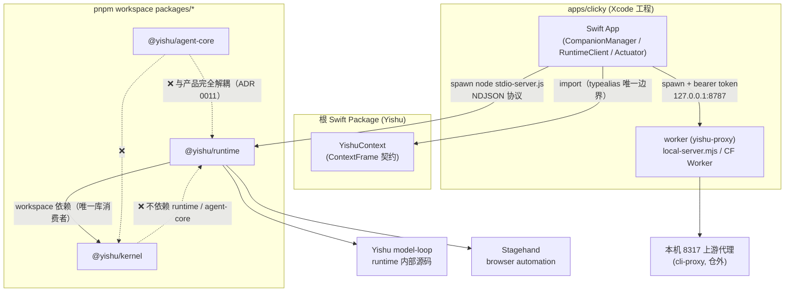

# 08 依赖关系

Type: wiki
Status: current
Verified: dd5a362 2026-08-23
Review: 包依赖或边界守卫规则变化时

## 包间依赖图

要点：

- **依赖方向单一**：`runtime → kernel` 是唯一包间库依赖；kernel 只依赖 Node 内置 + zod。
- **agent-core 孤立**：无产品消费者；CI 中独立验收（`pnpm --filter @yishu/agent-core check && test`）。
- **Swift ↔ Node 只经两条进程边界**：stdio NDJSON（runtime）与 HTTP 8787（worker）；无共享代码。

## 各包外部依赖

| 包 | 运行时依赖 | devDependencies |
|----|-----------|-----------------|
| 根（workspace） | — | —（脚本入口） |
| `@yishu/kernel` | `zod ^4.1.12` | typescript、tsx、@types/node |
| `@yishu/runtime` | `@browserbasehq/stagehand`、`@yishu/kernel`（workspace）、`typebox`、`zod` | typescript、tsx、@types/node |
| `@yishu/agent-core` | （无外部运行时依赖，纯 Node 内置） | typescript、tsx 等 |
| `apps/clicky`（Swift） | `YishuContext`（根 Swift 包）；系统框架（SwiftUI/AppKit/AVFoundation/Vision/ScreenCaptureKit/UNUserNotificationCenter/AXUIElement/Quartz） | — |
| `apps/clicky/worker` | —（node http / CF runtime） | wrangler |

运行环境：Node ≥ 22.19（`node:sqlite`、`engines` 强制）、macOS 14+、Xcode 16+、pnpm 10（`packageManager` 固定）。

## 数据与存储归属

| 数据 | 位置 | 拥有者 |
|------|------|--------|
| 产品真相（对话/记忆/任务/Mind/suggestion） | `~/Library/Application Support/Yishu/Store/*.sqlite`（默认） | `@yishu/kernel` store |
| runtime 会话 | 进程内（自有 model-loop 缓存，非真相） | `@yishu/runtime` |
| provider OAuth 凭据 | runtime 凭据存储（0700/0600 文件锁） | `@yishu/runtime` auth-store |
| 语音/模型 API key | `worker/.dev.vars` → `~/Library/Application Support/Yishu/Worker/.dev.vars`（0600） | worker |
| 会话身份（conversationId、scope、语速等） | UserDefaults | Clicky |
| 实验室产物（轨迹/经验/记分板/快照） | `packages/agent-core/data/` | agent-core（不入产品） |

## 边界守卫（script/check-product-boundaries.sh）

`pnpm product:check` / `product:verify` 的第一步，两个原语：`require_literal`（文件必须含字面量）与 `reject_source_pattern`（禁止模式，rg 检查、排除 dist/.build）。

| # | 规则 | 实现 |
|---|------|------|
| 1 | 唯一 macOS App 源码 | pbxproj 必含 `com.yishu.yishu-buddy`；Package.swift 必含 `Sources/YishuContext`；`apps/macos` 不得存在；不得出现第二个 executableTarget |
| 2 | 正式 Clicky 固定启动唯一自有循环 | `YishuAgentRuntimeClient.swift` 必含兼容值 `YISHU_RUNTIME_MODE = "pi"` 与 `YISHU_PRODUCT_KERNEL = "1"`；`runtime-factory.ts` 只能把该值装配为 `YishuLoopRuntimeAdapter`；run-local.sh 必含 `rm -rf bundle_root` 与 `ENABLE_DEBUG_DYLIB=NO` |
| 3 | AgentCore 不得接回产品 | `apps/clicky/leanring-buddy`、`packages/runtime/src`、runtime `package.json`、run-local.sh 不得含 `@yishu/agent-core` / `AgentCoreRuntime` / `packages/agent-core` |
| 4 | Kairos 不得复活 | `apps/` 与 `packages/` 不得含 `KairosBridgeClient` / `RunProgressPresenter` / `forceKairosRouting` |

## TypeScript 共享配置

`tsconfig.base.json`：`ES2022` / `NodeNext` / strict + `noUncheckedIndexedAccess` + `exactOptionalPropertyTypes`——所有包继承；import 必须带 `.js` 扩展名（ESM 相对导入）。
