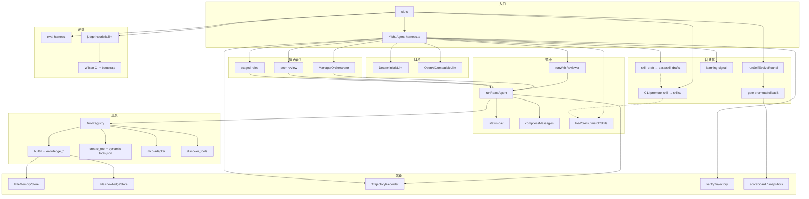

# @yishu/agent-core

奕枢（Yishu）的离线优先 Agent 核心：ReAct 循环、沙箱工具、文件记忆、知识库、Skills、多 Agent、评估 / Judge、轨迹落盘、离线 MCP 适配、动态工具与自进化 gate。

默认用 `DeterministicLlm`（规则路由），无需 API Key，测试与 CLI 可复现。
可选 OpenAI 兼容 API（OpenAI / OpenRouter / 本地代理）。

> 这是书义教学与验收 harness，**不是**第二个对外产品身份。
> 正式桌面交互仍在二开 Clicky；产品运行时边界在 `@yishu/runtime`。

## 快速开始

仓库根目录：

```bash
pnpm install
pnpm agent:test      # 153 pass
pnpm agent:demo      # 含 knowledge + mcp-list
pnpm agent:eval      # 6/6
pnpm agent -- judge-eval   # gold + judge + Wilson/bootstrap CI
pnpm agent:evolve    # 离线自进化一轮
pnpm agent -- mcp-list
pnpm agent -- run "计算 17*19+3"
pnpm agent -- run "关于 ReAct 模式"
pnpm agent -- run "创建工具 greeter kind=const body=hello-from-dynamic"
pnpm agent -- multi "搜索 react agent 并计算 10+5"
pnpm agent -- peer "计算 17*19+3"
pnpm agent -- staged "列目录 ."
pnpm agent -- promote-skill data/trajectories/<id>.json --dry-run
```

包内：

```bash
cd packages/agent-core
pnpm test
pnpm cli -- demo
pnpm cli -- run "列目录 ."
pnpm cli -- evolve
pnpm cli -- judge-eval
pnpm cli -- mcp-list
pnpm check   # tsc --noEmit
pnpm build   # 产出 dist/（bin: yishu-agent）
```

## CLI

| 命令 | 作用 |
|------|------|
| `run "任务"` | 单 Agent ReAct（默认开启 reviewer；可走 create_tool） |
| `multi "任务"` | Manager 拆任务 → researcher / coder / reviewer |
| `peer "任务"` | Proposer + Critic 隔离对等协作 |
| `staged "任务"` | planner → worker → checker 分阶段换角色 |
| `eval` | 内置黄金集 6 条（math / memory / list / search / write / knowledge） |
| `judge-eval [--judge=heuristic\|llm]` | 黄金集 + 离线 heuristic 或可选 LLM judge + Wilson/bootstrap CI |
| `demo` | 固定离线演示串（含 knowledge + mcp-list） |
| `serve-events` | EventBus + AsyncAgent 事件驱动 demo |
| `evolve` | 离线自进化一轮（baseline → gate → scoreboard） |
| `mcp-list` | 列出 `data/mcp/*.json` 注册的适配工具 |
| `verify <trajectory.json>` | 离线规则校验轨迹 |
| `promote-skill <trajectory.json> [--dry-run]` | 轨迹 Skill 草稿晋升到 live `skills/` |
| `--help` | 用法 |

LLM 选择：

```bash
pnpm agent -- --llm=mock run "…"      # 强制 DeterministicLlm
pnpm agent -- --llm=openai run "…"    # OpenAI 兼容（需 Key）
pnpm agent -- --llm=openai judge-eval --judge=llm
```

根脚本：`pnpm agent:test` / `agent:eval` / `agent:demo` / `agent:evolve`。

## 环境变量

| 变量 | 含义 | 默认 |
|------|------|------|
| `YISHU_AGENT_LLM` | `openai` \| `mock` \| `deterministic` | 未设：有 Key 则 openai，否则 mock |
| `OPENAI_API_KEY` | OpenAI 或兼容服务密钥 | — |
| `OPENROUTER_API_KEY` | OpenRouter 密钥（无 `OPENAI_API_KEY` 时用） | — |
| `OPENAI_BASE_URL` | Chat Completions 基址 | OpenAI：`https://api.openai.com/v1`；仅 OpenRouter Key 时：`https://openrouter.ai/api/v1` |
| `OPENAI_MODEL` | 模型名 | `gpt-4o-mini` |
| `OPENAI_TIMEOUT_MS` | 请求超时毫秒 | `60000` |

工厂函数：`createLlmFromEnv` / `createOpenAiFromEnv`（`src/llm-openai.ts`）。

## 数据与目录

相对包根 `packages/agent-core/`：

| 路径 | 用途 |
|------|------|
| `workspace/` | 工具沙箱工作区 |
| `skills/*/SKILL.md` | 渐进披露 Skills（coding / memory / research；promote-skill 写入处） |
| `data/memory.json` | 跨 run 记忆卡 |
| `data/knowledge/index.json` | 知识库（FileKnowledgeStore） |
| `data/mcp/*.json` | 离线 MCP 服务器工具描述 |
| `data/dynamic-tools.json` | `create_tool` 持久化定义（echo/const/template） |
| `data/skill-drafts/` | 自动 Skill 草稿（**不**污染 live skills/） |
| `data/trajectories/<id>.json` | 完整轨迹 |
| `data/trajectories/<id>.signal.json` | 学习信号摘要 |
| `data/trajectories/<id>.verify.json` | 轨迹规则校验结果 |
| `data/trajectories/<id>.skill.json` | 自动草稿旁路元数据（path / auto / promoted） |
| `data/evolution/experience.jsonl` | 在线经验追加 |
| `data/evolution/scoreboard.json` | 自进化轮次记分板 |
| `data/evolution/state/identity/INSTRUCTIONS.md` | promote 后的耐久指令 |
| `data/evolution/snapshots/` | gate 前状态快照 |
| `data/evolution/work/` | baseline / candidate 评测工作区 |

`defaultPaths(packageRoot)` 在 `src/harness.ts`。

## 架构



### 模块一览

| 模块 | 文件 | 职责 |
|------|------|------|
| 类型 | `src/types.ts` | 消息、工具、轨迹、配置 |
| LLM 端口 | `src/llm.ts` | `LlmPort` + 离线规则模型 |
| OpenAI | `src/llm-openai.ts` | 兼容 Chat Completions |
| ReAct | `src/loop/react.ts` | 想 → 调工具 → 观察 → 结束 |
| 审核 | `src/loop/verify.ts` | 规则 reviewer |
| 工具 | `src/tools/*` | 注册表、内置集、活跃发现、MCP 适配、动态 create_tool |
| 记忆 | `src/memory/store.ts` | JSON 记忆卡 |
| 知识库 | `src/knowledge/store.ts` | 文件索引 + token 重叠检索 |
| 上下文 | `src/context/*` | 状态栏、压缩、Skills |
| 多 Agent | `src/multi/*` | Manager / peer / staged |
| 评估 | `src/eval/harness.ts` | 黄金用例与 pass rate |
| Judge | `src/eval/judge.ts` | heuristic / llm 判分 |
| 统计 | `src/eval/stats.ts` / `significance.ts` | Wilson 比例 CI；bootstrap 均值 CI |
| 轨迹 | `src/trajectory/*` | 步骤时间线 + 规则校验 |
| 事件 | `src/events/*` | 优先队列 + AsyncAgent |
| 学习信号 | `src/evolution/learning-signal.ts` | outcome / lessons / experience |
| Skill 草稿 | `src/evolution/skill-draft.ts` | 轨迹 → 草稿（auto → `data/skill-drafts/`） |
| 自进化 | `src/evolution/loop.ts` 等 | baseline → diagnose → propose → gate |
| 安全 | `src/security/injection-guard.ts` | 提示注入启发式 |
| 导出 | `src/index.ts` | 公共 API |

### 默认配置

`DEFAULT_AGENT_CONFIG`：

- `maxIterations`: 8
- `maxReviewRounds`: 2
- `enableReview`: true（CLI `run` 开启；`eval` 内部为隔离会关审核）
- `enableAutoSkillDraft`: true（写 `data/skill-drafts/`，不写 live skills/）

## 库用法

```ts
import {
  YishuAgent,
  defaultPaths,
  DeterministicLlm,
  createLlmFromEnv,
  runSelfEvolveRound,
  runEvalWithJudge,
  FileKnowledgeStore,
} from "@yishu/agent-core";

const paths = defaultPaths("/path/to/packages/agent-core");
const agent = new YishuAgent({
  workspaceDir: paths.workspaceDir,
  skillsDir: paths.skillsDir,
  memoryPath: paths.memoryPath,
  trajectoriesDir: paths.trajectoriesDir,
  knowledgeDir: paths.knowledgeDir,
  enableReview: true,
  llm: createLlmFromEnv(),
});

const result = await agent.run("计算 17*19+3", (step) => {
  console.log(step.kind, step.data);
});
console.log(result.finalText, result.accepted, result.toolsUsed);
```

构建后入口：`dist/index.js`；CLI bin：`yishu-agent` → `dist/cli.js`。

## 测试

```bash
pnpm test
# 当前：153 tests / 24 suites（node:test）
# 覆盖：react / multi / peer / staged / memory / knowledge / skills /
#       compress / eval / judge / reviewer / sandbox / events /
#       learning-signal / evolution-loop / trajectory-verify /
#       discovery / mcp-adapter / injection / llm-openai / agent-core /
#       stats / significance / dynamic-tool / auto-skill
```

## 与产品边界

```text
@yishu/agent-core  ──书义环 / CLI / eval / judge / evolve──▶ 可独立验收
        │ 不替代
        ▼
@yishu/runtime     ──AgentRuntime + Pi──▶ 桌面任务真相
        │
        ▼
二开 Clicky / apps/macos
```

能力对照与验收：

- `docs/agent-book/CAPABILITY_MAP.md`
- `docs/agent-book/TRY_ME.md`
- `docs/agent-book/research/EVOLUTION_LOOP.md`
- `docs/acceptance/v0-agent-book-harness.md`

## 明确未做

- Ch7 模型后训练
- agent-core 内全双工语音
- 机器人 / VLA
- 远端 MCP SDK
- 向量 embedding / ANN
