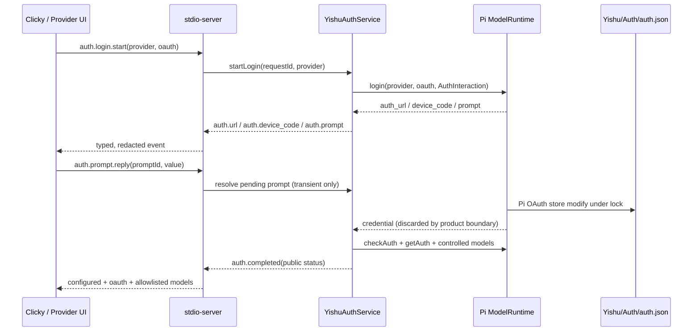

# Yishu OAuth runtime boundary

Type: architecture
Status: current
Verified: 21629d6 2026-08-10
Review: auth-service / auth-store / auth-protocol 变化时

The runtime exposes only the product-owned `openai-codex` and `xai` OAuth
providers. `yishu-local-grok` remains the default loopback route. The xAI path
is labelled `experimental_local_subscription` because Pi's local subscription
flow is not the same thing as a stable direct `api.x.ai` API-key contract.

`access`, `refresh`, `api_key`, account identifiers, and raw provider errors
never enter a runtime event, log, or trace. The auth file is created lazily at
`~/Library/Application Support/Yishu/Auth/auth.json`; its directory is `0700`,
the file is `0600`, and modifications use a cross-process lock. Tests inject
`InMemoryCredentialStore` and never start a real login or network request.
